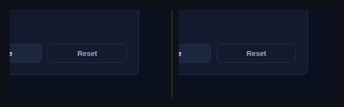
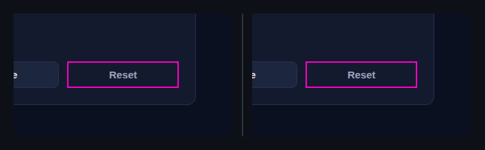

## 🗺️ StyleProof report

**1 computed-style difference(s)** across 1 distinct change(s) in 3 surface(s).

### `button` · 1 element restyled

_Identical across 3 surfaces: threshold-counter @ 1280, 768, 390_

◀ before  ·  after ▶ — threshold-counter @ 1280

🔍 magenta boxes mark each change — changed: `button.threshold-counter__button`

- **`button`** — +1 more

Show the property change

**`button`**

Style:

| Property | Before | After |
| --- | --- | --- |
| `background-position` | `0% ×2` | `0px ×2` |

