## 🗺️ StyleProof report

**6 DOM change(s) · 72 computed-style difference(s) · 4 state-delta difference(s)** across 1 distinct change(s) in 3 surface(s).

🆕 **9 new surface(s)** captured with no baseline to compare — shown below for review. Approve them before they become the baseline.

### `section.service-status` · 6 elements added

_Identical across 3 surfaces: threshold-counter @ 1280, 768, 390_

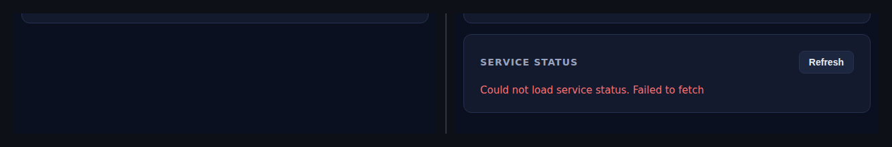

◀ before  ·  after ▶ — threshold-counter @ 1280

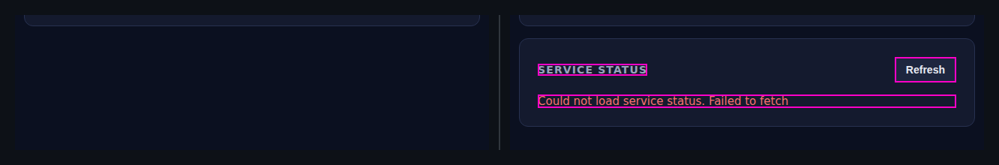

🔍 magenta boxes mark each change — changed: `button.service-status__button`, `h2.service-status__heading`, `p.service-status__message`

- **6** elements added
- interaction states changed: `:hover`, `:focus`

Show all 76 property changes

**Added** `section.service-status`

Style:

| Property | Value |
| --- | --- |
| `padding` | `24px` |
| `border-width` | `1px` |
| `border-style` | `solid` |
| `border-color` | `#273150` |
| `border-radius` | `12px` |
| `background-color` | `#141a2e` |
| `color` | `#e6e9f2` |
| `font-family` | `ui-sans-serif, system-ui, -apple-system, "Segoe UI", Roboto, sans-serif` |
| `-webkit-locale` | `"en"` |
| `box-sizing` | `border-box` |
| `margin-top` | `16px` |
| `row-rule-color` | `#e6e9f2` |

**Added** `div`

Style:

| Property | Value |
| --- | --- |
| `display` | `flex` |
| `justify-content` | `space-between` |
| `align-items` | `center` |
| `gap` | `12px` |
| `border-color` | `#e6e9f2` |
| `color` | `#e6e9f2` |
| `font-family` | `ui-sans-serif, system-ui, -apple-system, "Segoe UI", Roboto, sans-serif` |
| `-webkit-locale` | `"en"` |
| `box-sizing` | `border-box` |
| `margin-bottom` | `16px` |
| `row-rule-color` | `#e6e9f2` |

**Added** `button`

Style:

| Property | Value |
| --- | --- |
| `display` | `block` |
| `padding` | `8px 14px` |
| `border-width` | `1px` |
| `border-style` | `solid` |
| `border-color` | `#273150` |
| `border-radius` | `8px` |
| `background-color` | `#1d263f` |
| `color` | `#e6e9f2` |
| `font-size` | `14px` |
| `font-weight` | `600` |
| `-webkit-locale` | `"en"` |
| `cursor` | `pointer` |
| `min-block-size` | `auto` |
| `min-inline-size` | `auto` |
| `row-rule-color` | `#e6e9f2` |
| `transition-behavior` | `normal, normal` |
| `transition-delay` | `0s, 0s` |
| `transition-duration` | `0.12s, 0.12s` |
| `transition-property` | `background, border-color` |
| `transition-timing-function` | `ease, ease` |

Interactive states:

| State | Property | Value |
| --- | --- | --- |
| `:hover` | `border-color` | `#3a4a72` |
| `:hover` | `background-color` | `#26314f` |
| `:focus` | `outline` | `2px solid rgb(74, 222, 128)` |
| `:focus` | `outline-offset` | `2px` |

**Added** `h2`

Style:

| Property | Value |
| --- | --- |
| `border-color` | `#9aa3bd` |
| `color` | `#9aa3bd` |
| `font-family` | `ui-sans-serif, system-ui, -apple-system, "Segoe UI", Roboto, sans-serif` |
| `font-size` | `14px` |
| `letter-spacing` | `1.12px` |
| `text-transform` | `uppercase` |
| `-webkit-locale` | `"en"` |
| `box-sizing` | `border-box` |
| `margin-bottom` | `0px` |
| `margin-top` | `0px` |
| `min-block-size` | `auto` |
| `min-inline-size` | `auto` |
| `row-rule-color` | `#9aa3bd` |

**Added** `output`

Style:

| Property | Value |
| --- | --- |
| `display` | `block` |
| `border-color` | `#e6e9f2` |
| `color` | `#e6e9f2` |
| `font-family` | `ui-sans-serif, system-ui, -apple-system, "Segoe UI", Roboto, sans-serif` |
| `-webkit-locale` | `"en"` |
| `box-sizing` | `border-box` |
| `row-rule-color` | `#e6e9f2` |

**Added** `p`

Style:

| Property | Value |
| --- | --- |
| `border-color` | `#f87171` |
| `color` | `#f87171` |
| `font-family` | `ui-sans-serif, system-ui, -apple-system, "Segoe UI", Roboto, sans-serif` |
| `font-size` | `15px` |
| `-webkit-locale` | `"en"` |
| `box-sizing` | `border-box` |
| `margin-bottom` | `0px` |
| `margin-top` | `0px` |
| `row-rule-color` | `#f87171` |

### `service-status-empty@1280` · new surface <!-- styleproof-new -->

_service-status-empty @ 1280_

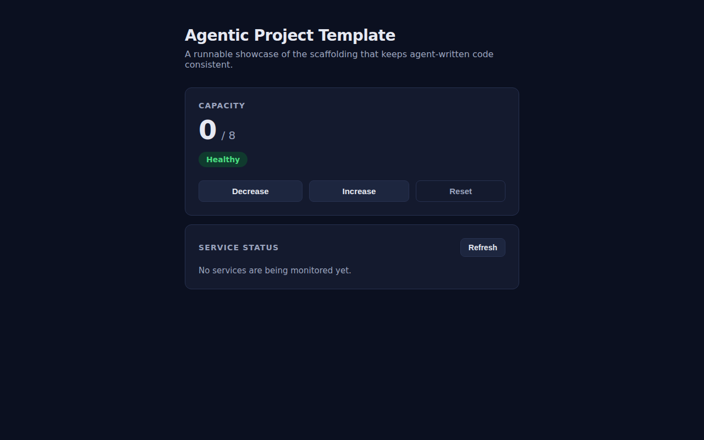

after · service-status-empty @ 1280

_No baseline to compare against — this surface is new. Review and approve it before it becomes part of the baseline._

### `service-status-empty@390` · new surface <!-- styleproof-new -->

_service-status-empty @ 390_

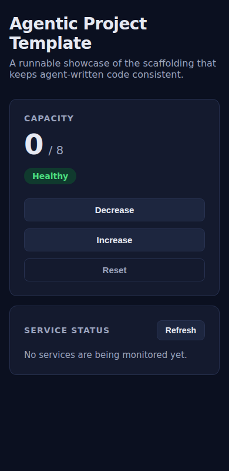

after · service-status-empty @ 390

_No baseline to compare against — this surface is new. Review and approve it before it becomes part of the baseline._

### `service-status-empty@768` · new surface <!-- styleproof-new -->

_service-status-empty @ 768_

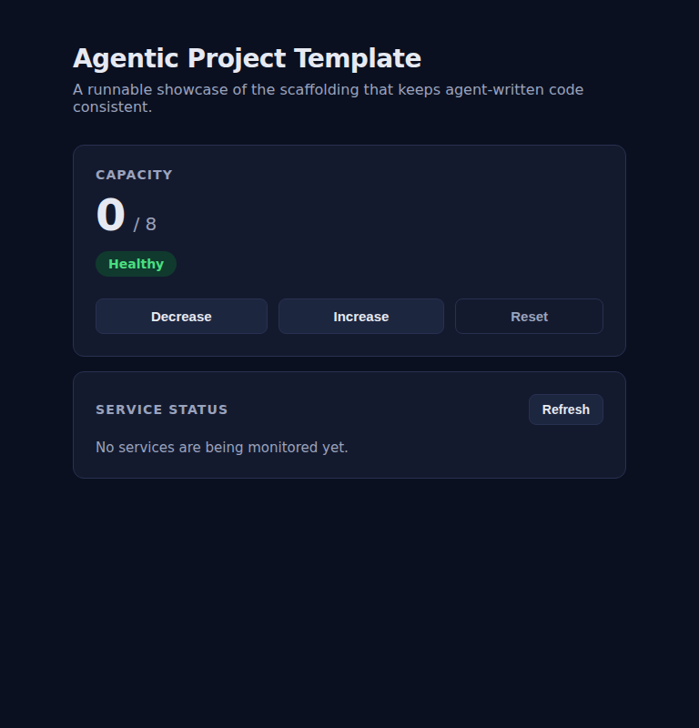

after · service-status-empty @ 768

_No baseline to compare against — this surface is new. Review and approve it before it becomes part of the baseline._

### `service-status-error@1280` · new surface <!-- styleproof-new -->

_service-status-error @ 1280_

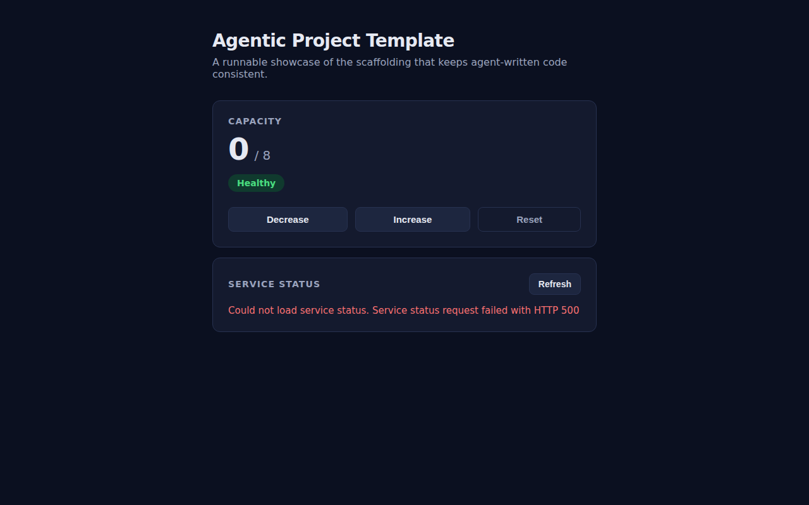

after · service-status-error @ 1280

_No baseline to compare against — this surface is new. Review and approve it before it becomes part of the baseline._

### `service-status-error@390` · new surface <!-- styleproof-new -->

_service-status-error @ 390_

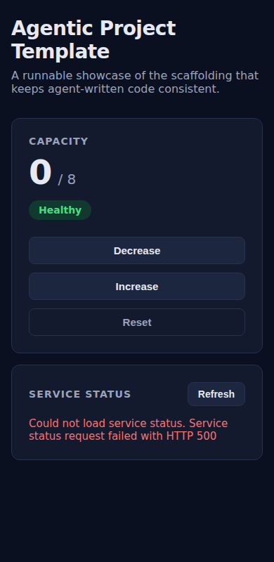

after · service-status-error @ 390

_No baseline to compare against — this surface is new. Review and approve it before it becomes part of the baseline._

### `service-status-error@768` · new surface <!-- styleproof-new -->

_service-status-error @ 768_

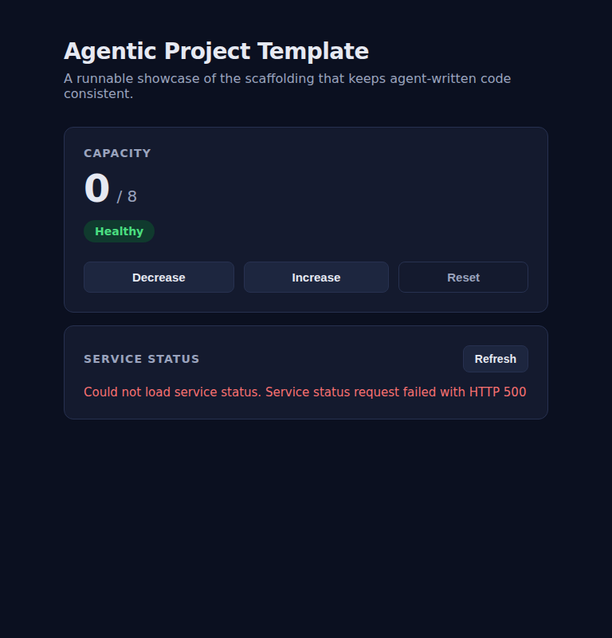

after · service-status-error @ 768

_No baseline to compare against — this surface is new. Review and approve it before it becomes part of the baseline._

### `service-status-success@1280` · new surface <!-- styleproof-new -->

_service-status-success @ 1280_

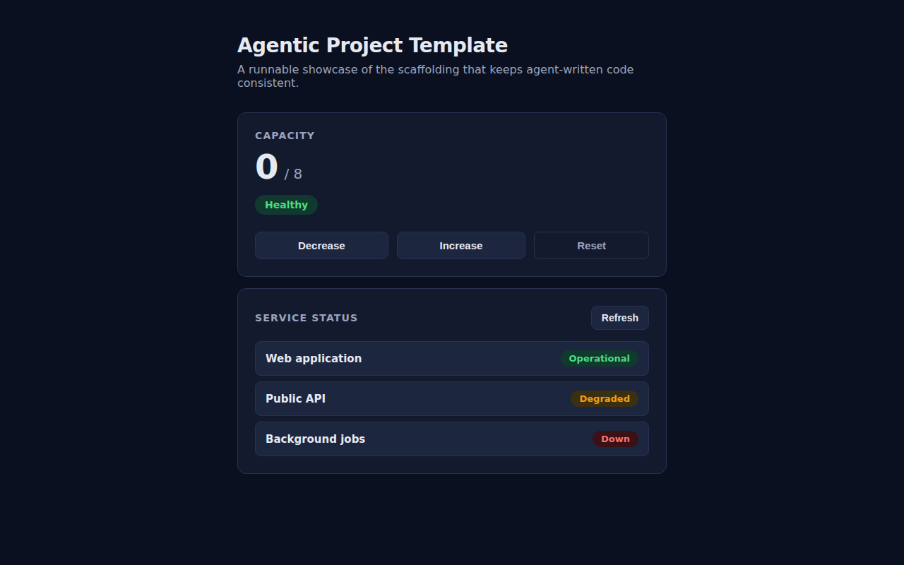

after · service-status-success @ 1280

_No baseline to compare against — this surface is new. Review and approve it before it becomes part of the baseline._

### `service-status-success@390` · new surface <!-- styleproof-new -->

_service-status-success @ 390_

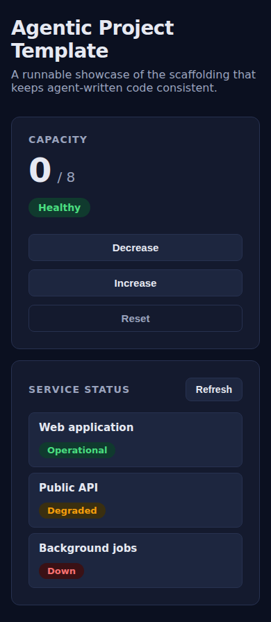

after · service-status-success @ 390

_No baseline to compare against — this surface is new. Review and approve it before it becomes part of the baseline._

### `service-status-success@768` · new surface <!-- styleproof-new -->

_service-status-success @ 768_

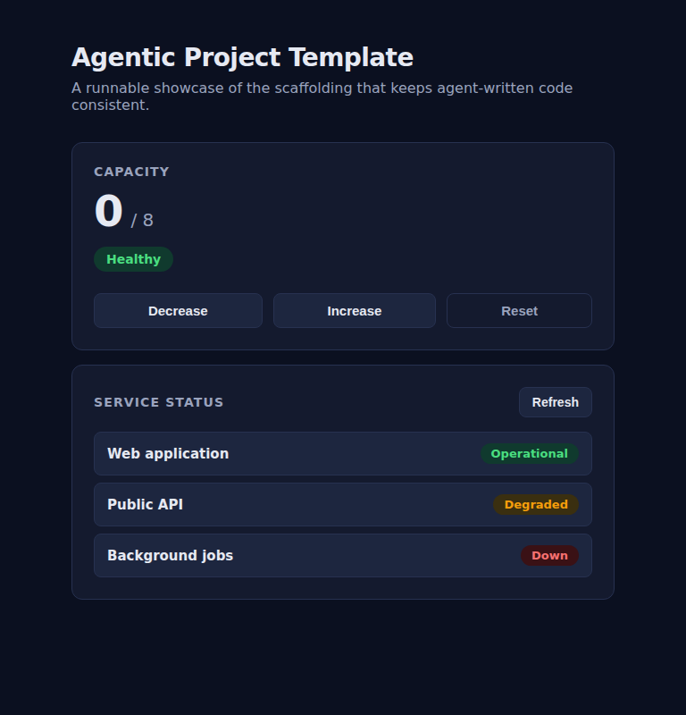

after · service-status-success @ 768

_No baseline to compare against — this surface is new. Review and approve it before it becomes part of the baseline._
