## 🗺️ StyleProof report

**Certification**
- **Coverage** — ⚠ not asserted (no `expected` registry; certifies only the captured surfaces)
- **Determinism** — ✓ proven (base self-checked, head replayed)
- **Inventory** — ✓ navigable set unchanged
- **Data residue** — ✓ 1 failing endpoint(s), all acknowledged

**432 DOM change(s) · 2694 computed-style difference(s) · 288 state-delta difference(s)** across 9 distinct change(s) in 12 existing surface(s).

## Element-level changes

---

## 🧱 Global chrome changes — across all 4 surface(s)

_9 change(s) rode the shared frame every view draws (a persistent nav, header, or footer): each touched every surface that renders the affected element, so it reads as ONE global change, not a per-view one. The detail is folded beneath — review it once._

### `div` · 21 elements removed

_service-status-empty @ 1280_

◀ before  ·  after ▶ — service-status-empty @ 1280

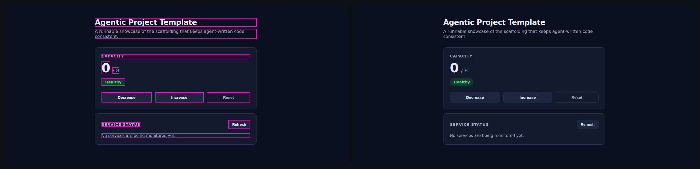

🔍 magenta boxes mark each change — changed: `h1.app__title`, `p.app__tagline`, `button.threshold-counter__button`

- **21** elements removed
- interaction states changed: `:hover`, `:focus`

Show all 16 property changes

**Removed** `div` ×3

**Removed** `main.app`

**Removed** `header`

**Removed** `h1`

**Removed** `p` ×3

**Removed** `section.threshold-counter`

**Removed** `button` ×4

**Removed** `h2` ×2

**Removed** `output` ×2

**Removed** `span` ×2

**Removed** `section.service-status`

### `div` · 21 elements added

_service-status-empty @ 1280_

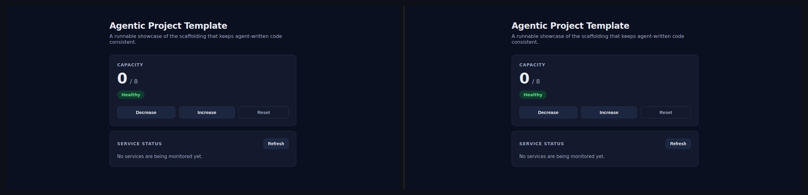

◀ before  ·  after ▶ — service-status-empty @ 1280

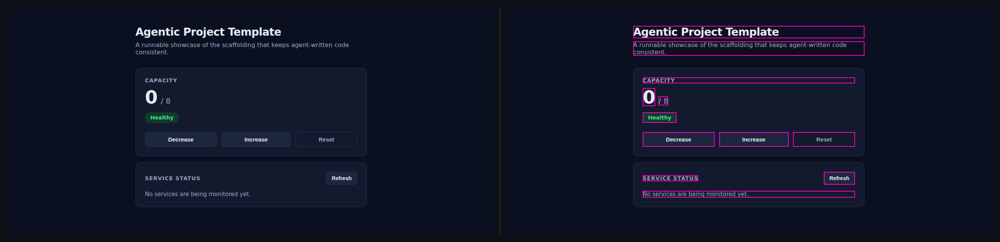

🔍 magenta boxes mark each change — changed: `h1.app__title`, `p.app__tagline`, `button.threshold-counter__button`

- **21** elements added
- interaction states changed: `:hover`, `:focus`

Show all 268 property changes

**Added** `div`

Style:

| Property | Value |
| --- | --- |
| `border-color` | `#e6e9f2` |
| `color` | `#e6e9f2` |
| `font-family` | `ui-sans-serif, system-ui, -apple-system, "Segoe UI", Roboto, sans-serif` |
| `-webkit-locale` | `"en"` |
| `box-sizing` | `border-box` |
| `row-rule-color` | `#e6e9f2` |

**Added** `main.app`

Style:

| Property | Value |
| --- | --- |
| `padding` | `48px 16px` |
| `border-color` | `#e6e9f2` |
| `color` | `#e6e9f2` |
| `font-family` | `ui-sans-serif, system-ui, -apple-system, "Segoe UI", Roboto, sans-serif` |
| `-webkit-locale` | `"en"` |
| `box-sizing` | `border-box` |
| `margin-left` | `320px` |
| `margin-right` | `320px` |
| `max-inline-size` | `640px` |
| `row-rule-color` | `#e6e9f2` |

**Added** `header`

Style:

| Property | Value |
| --- | --- |
| `border-color` | `#e6e9f2` |
| `color` | `#e6e9f2` |
| `font-family` | `ui-sans-serif, system-ui, -apple-system, "Segoe UI", Roboto, sans-serif` |
| `-webkit-locale` | `"en"` |
| `box-sizing` | `border-box` |
| `margin-bottom` | `32px` |
| `row-rule-color` | `#e6e9f2` |

**Added** `h1`

Style:

| Property | Value |
| --- | --- |
| `border-color` | `#e6e9f2` |
| `color` | `#e6e9f2` |
| `font-family` | `ui-sans-serif, system-ui, -apple-system, "Segoe UI", Roboto, sans-serif` |
| `font-size` | `28px` |
| `letter-spacing` | `-0.56px` |
| `-webkit-locale` | `"en"` |
| `box-sizing` | `border-box` |
| `margin-bottom` | `8px` |
| `margin-top` | `0px` |
| `row-rule-color` | `#e6e9f2` |

**Added** `p`

Style:

| Property | Value |
| --- | --- |
| `border-color` | `#9aa3bd` |
| `color` | `#9aa3bd` |
| `font-family` | `ui-sans-serif, system-ui, -apple-system, "Segoe UI", Roboto, sans-serif` |
| `-webkit-locale` | `"en"` |
| `box-sizing` | `border-box` |
| `margin-bottom` | `0px` |
| `margin-top` | `0px` |
| `row-rule-color` | `#9aa3bd` |

**Added** `section.threshold-counter`

Style:

| Property | Value |
| --- | --- |
| `padding` | `24px` |
| `border-width` | `1px` |
| `border-style` | `solid` |
| `border-color` | `#273150` |
| `border-radius` | `12px` |
| `background-color` | `#141a2e` |
| `color` | `#e6e9f2` |
| `font-family` | `ui-sans-serif, system-ui, -apple-system, "Segoe UI", Roboto, sans-serif` |
| `-webkit-locale` | `"en"` |
| `box-sizing` | `border-box` |
| `row-rule-color` | `#e6e9f2` |

**Added** `div`

Style:

| Property | Value |
| --- | --- |
| `display` | `flex` |
| `gap` | `12px` |
| `border-color` | `#e6e9f2` |
| `color` | `#e6e9f2` |
| `font-family` | `ui-sans-serif, system-ui, -apple-system, "Segoe UI", Roboto, sans-serif` |
| `-webkit-locale` | `"en"` |
| `box-sizing` | `border-box` |
| `flex-wrap` | `wrap` |
| `row-rule-color` | `#e6e9f2` |

**Added** `button` ×2

Style:

| Property | Value |
| --- | --- |
| `display` | `block` |
| `padding` | `10px 16px` |
| `border-width` | `1px` |
| `border-style` | `solid` |
| `border-color` | `#273150` |
| `border-radius` | `8px` |
| `background-color` | `#1d263f` |
| `color` | `#e6e9f2` |
| `font-size` | `15px` |
| `font-weight` | `600` |
| `-webkit-locale` | `"en"` |
| `cursor` | `pointer` |
| `flex-grow` | `1` |
| `min-block-size` | `auto` |
| `min-inline-size` | `96px` |
| `row-rule-color` | `#e6e9f2` |
| `transition-behavior` | `normal, normal` |
| `transition-delay` | `0s, 0s` |
| `transition-duration` | `0.12s, 0.12s` |
| `transition-property` | `background, border-color` |
| `transition-timing-function` | `ease, ease` |

Interactive states:

| State | Property | Value |
| --- | --- | --- |
| `:hover` | `border-color` | `#3a4a72` |
| `:hover` | `background-color` | `#26314f` |
| `:focus` | `outline` | `2px solid rgb(74, 222, 128)` |
| `:focus` | `outline-offset` | `2px` |

**Added** `button`

Style:

| Property | Value |
| --- | --- |
| `display` | `block` |
| `padding` | `10px 16px` |
| `border-width` | `1px` |
| `border-style` | `solid` |
| `border-color` | `#273150` |
| `border-radius` | `8px` |
| `background-color` | `transparent` |
| `color` | `#9aa3bd` |
| `font-size` | `15px` |
| `font-weight` | `600` |
| `-webkit-locale` | `"en"` |
| `cursor` | `pointer` |
| `flex-grow` | `1` |
| `min-block-size` | `auto` |
| `min-inline-size` | `96px` |
| `row-rule-color` | `#9aa3bd` |
| `transition-behavior` | `normal, normal` |
| `transition-delay` | `0s, 0s` |
| `transition-duration` | `0.12s, 0.12s` |
| `transition-property` | `background, border-color` |
| `transition-timing-function` | `ease, ease` |

Interactive states:

| State | Property | Value |
| --- | --- | --- |
| `:hover` | `border-color` | `#3a4a72` |
| `:hover` | `background-color` | `#26314f` |
| `:focus` | `outline` | `2px solid rgb(74, 222, 128)` |
| `:focus` | `outline-offset` | `2px` |

**Added** `h2`

Style:

| Property | Value |
| --- | --- |
| `border-color` | `#9aa3bd` |
| `color` | `#9aa3bd` |
| `font-family` | `ui-sans-serif, system-ui, -apple-system, "Segoe UI", Roboto, sans-serif` |
| `font-size` | `14px` |
| `letter-spacing` | `1.12px` |
| `text-transform` | `uppercase` |
| `-webkit-locale` | `"en"` |
| `box-sizing` | `border-box` |
| `margin-bottom` | `12px` |
| `margin-top` | `0px` |
| `row-rule-color` | `#9aa3bd` |

**Added** `output`

Style:

| Property | Value |
| --- | --- |
| `display` | `inline-block` |
| `padding` | `6px 14px` |
| `border-color` | `#4ade80` |
| `border-radius` | `999px` |
| `background-color` | `#103a2e` |
| `color` | `#4ade80` |
| `font-family` | `ui-sans-serif, system-ui, -apple-system, "Segoe UI", Roboto, sans-serif` |
| `font-size` | `14px` |
| `font-weight` | `600` |
| `-webkit-locale` | `"en"` |
| `box-sizing` | `border-box` |
| `margin-bottom` | `24px` |
| `row-rule-color` | `#4ade80` |

**Added** `p`

Style:

| Property | Value |
| --- | --- |
| `display` | `flex` |
| `align-items` | `baseline` |
| `gap` | `8px` |
| `border-color` | `#e6e9f2` |
| `color` | `#e6e9f2` |
| `font-family` | `ui-sans-serif, system-ui, -apple-system, "Segoe UI", Roboto, sans-serif` |
| `-webkit-locale` | `"en"` |
| `box-sizing` | `border-box` |
| `margin-top` | `0px` |
| `row-rule-color` | `#e6e9f2` |

**Added** `span`

Style:

| Property | Value |
| --- | --- |
| `display` | `block` |
| `border-color` | `#e6e9f2` |
| `color` | `#e6e9f2` |
| `font-family` | `ui-sans-serif, system-ui, -apple-system, "Segoe UI", Roboto, sans-serif` |
| `font-size` | `48px` |
| `font-weight` | `700` |
| `line-height` | `48px` |
| `-webkit-locale` | `"en"` |
| `box-sizing` | `border-box` |
| `min-block-size` | `auto` |
| `min-inline-size` | `auto` |
| `row-rule-color` | `#e6e9f2` |

**Added** `span`

Style:

| Property | Value |
| --- | --- |
| `display` | `block` |
| `border-color` | `#9aa3bd` |
| `color` | `#9aa3bd` |
| `font-family` | `ui-sans-serif, system-ui, -apple-system, "Segoe UI", Roboto, sans-serif` |
| `font-size` | `20px` |
| `-webkit-locale` | `"en"` |
| `box-sizing` | `border-box` |
| `min-block-size` | `auto` |
| `min-inline-size` | `auto` |
| `row-rule-color` | `#9aa3bd` |

**Added** `section.service-status`

Style:

| Property | Value |
| --- | --- |
| `padding` | `24px` |
| `border-width` | `1px` |
| `border-style` | `solid` |
| `border-color` | `#273150` |
| `border-radius` | `12px` |
| `background-color` | `#141a2e` |
| `color` | `#e6e9f2` |
| `font-family` | `ui-sans-serif, system-ui, -apple-system, "Segoe UI", Roboto, sans-serif` |
| `-webkit-locale` | `"en"` |
| `box-sizing` | `border-box` |
| `margin-top` | `16px` |
| `row-rule-color` | `#e6e9f2` |

**Added** `div`

Style:

| Property | Value |
| --- | --- |
| `display` | `flex` |
| `justify-content` | `space-between` |
| `align-items` | `center` |
| `gap` | `12px` |
| `border-color` | `#e6e9f2` |
| `color` | `#e6e9f2` |
| `font-family` | `ui-sans-serif, system-ui, -apple-system, "Segoe UI", Roboto, sans-serif` |
| `-webkit-locale` | `"en"` |
| `box-sizing` | `border-box` |
| `margin-bottom` | `16px` |
| `row-rule-color` | `#e6e9f2` |

**Added** `button`

Style:

| Property | Value |
| --- | --- |
| `display` | `block` |
| `padding` | `8px 14px` |
| `border-width` | `1px` |
| `border-style` | `solid` |
| `border-color` | `#273150` |
| `border-radius` | `8px` |
| `background-color` | `#1d263f` |
| `color` | `#e6e9f2` |
| `font-size` | `14px` |
| `font-weight` | `600` |
| `-webkit-locale` | `"en"` |
| `cursor` | `pointer` |
| `min-block-size` | `auto` |
| `min-inline-size` | `auto` |
| `row-rule-color` | `#e6e9f2` |
| `transition-behavior` | `normal, normal` |
| `transition-delay` | `0s, 0s` |
| `transition-duration` | `0.12s, 0.12s` |
| `transition-property` | `background, border-color` |
| `transition-timing-function` | `ease, ease` |

Interactive states:

| State | Property | Value |
| --- | --- | --- |
| `:hover` | `border-color` | `#3a4a72` |
| `:hover` | `background-color` | `#26314f` |
| `:focus` | `outline` | `2px solid rgb(74, 222, 128)` |
| `:focus` | `outline-offset` | `2px` |

**Added** `h2`

Style:

| Property | Value |
| --- | --- |
| `border-color` | `#9aa3bd` |
| `color` | `#9aa3bd` |
| `font-family` | `ui-sans-serif, system-ui, -apple-system, "Segoe UI", Roboto, sans-serif` |
| `font-size` | `14px` |
| `letter-spacing` | `1.12px` |
| `text-transform` | `uppercase` |
| `-webkit-locale` | `"en"` |
| `box-sizing` | `border-box` |
| `margin-bottom` | `0px` |
| `margin-top` | `0px` |
| `min-block-size` | `auto` |
| `min-inline-size` | `auto` |
| `row-rule-color` | `#9aa3bd` |

**Added** `output`

Style:

| Property | Value |
| --- | --- |
| `display` | `block` |
| `border-color` | `#e6e9f2` |
| `color` | `#e6e9f2` |
| `font-family` | `ui-sans-serif, system-ui, -apple-system, "Segoe UI", Roboto, sans-serif` |
| `-webkit-locale` | `"en"` |
| `box-sizing` | `border-box` |
| `row-rule-color` | `#e6e9f2` |

**Added** `p`

Style:

| Property | Value |
| --- | --- |
| `border-color` | `#9aa3bd` |
| `color` | `#9aa3bd` |
| `font-family` | `ui-sans-serif, system-ui, -apple-system, "Segoe UI", Roboto, sans-serif` |
| `font-size` | `15px` |
| `-webkit-locale` | `"en"` |
| `box-sizing` | `border-box` |
| `margin-bottom` | `0px` |
| `margin-top` | `0px` |
| `row-rule-color` | `#9aa3bd` |

### `div` · 21 elements removed

_service-status-empty @ 390_

◀ before  ·  after ▶ — service-status-empty @ 390

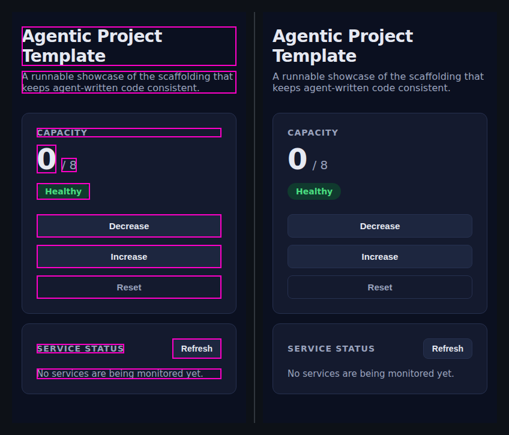

🔍 magenta boxes mark each change — changed: `h1.app__title`, `p.app__tagline`, `button.threshold-counter__button`

- **21** elements removed
- interaction states changed: `:hover`, `:focus`

Show all 16 property changes

**Removed** `div` ×3

**Removed** `main.app`

**Removed** `header`

**Removed** `h1`

**Removed** `p` ×3

**Removed** `section.threshold-counter`

**Removed** `button` ×4

**Removed** `h2` ×2

**Removed** `output` ×2

**Removed** `span` ×2

**Removed** `section.service-status`

### `div` · 21 elements added

_service-status-empty @ 390_

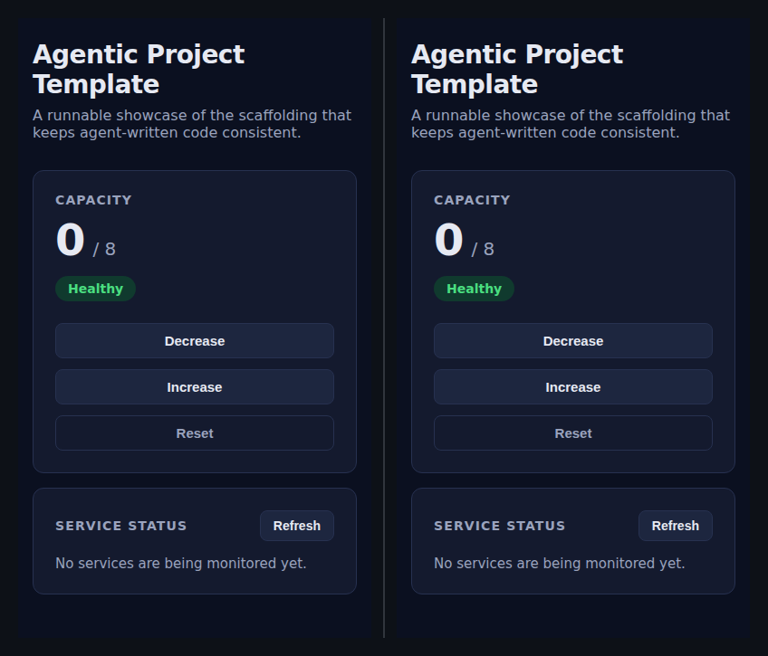

◀ before  ·  after ▶ — service-status-empty @ 390

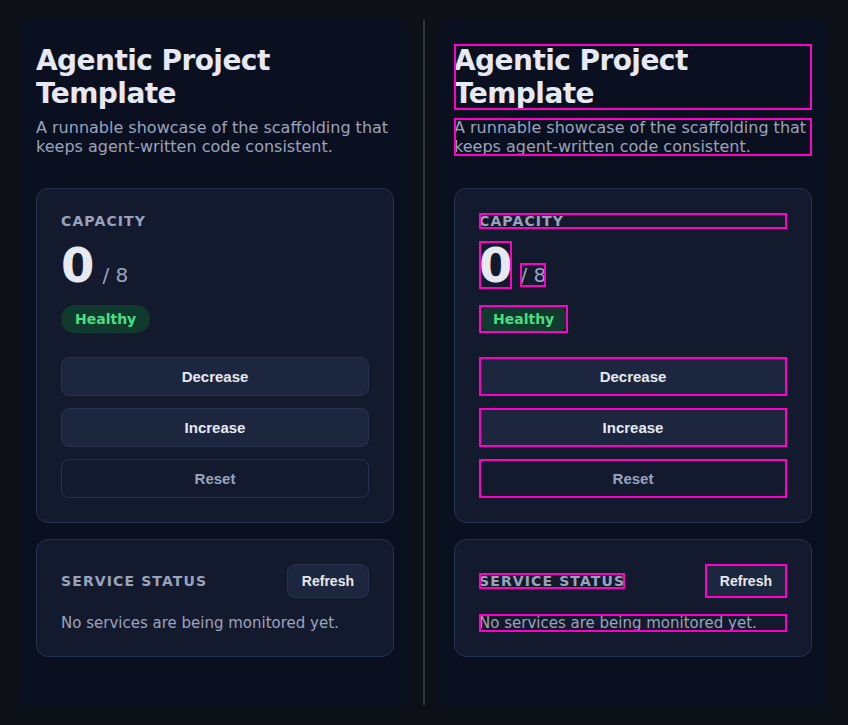

🔍 magenta boxes mark each change — changed: `h1.app__title`, `p.app__tagline`, `button.threshold-counter__button`

- **21** elements added
- interaction states changed: `:hover`, `:focus`

Show all 267 property changes

**Added** `div`

Style:

| Property | Value |
| --- | --- |
| `border-color` | `#e6e9f2` |
| `color` | `#e6e9f2` |
| `font-family` | `ui-sans-serif, system-ui, -apple-system, "Segoe UI", Roboto, sans-serif` |
| `-webkit-locale` | `"en"` |
| `box-sizing` | `border-box` |
| `row-rule-color` | `#e6e9f2` |

**Added** `main.app`

Style:

| Property | Value |
| --- | --- |
| `padding` | `24px 16px` |
| `border-color` | `#e6e9f2` |
| `color` | `#e6e9f2` |
| `font-family` | `ui-sans-serif, system-ui, -apple-system, "Segoe UI", Roboto, sans-serif` |
| `-webkit-locale` | `"en"` |
| `box-sizing` | `border-box` |
| `max-inline-size` | `640px` |
| `row-rule-color` | `#e6e9f2` |

**Added** `header`

Style:

| Property | Value |
| --- | --- |
| `border-color` | `#e6e9f2` |
| `color` | `#e6e9f2` |
| `font-family` | `ui-sans-serif, system-ui, -apple-system, "Segoe UI", Roboto, sans-serif` |
| `-webkit-locale` | `"en"` |
| `box-sizing` | `border-box` |
| `margin-bottom` | `32px` |
| `row-rule-color` | `#e6e9f2` |

**Added** `h1`

Style:

| Property | Value |
| --- | --- |
| `border-color` | `#e6e9f2` |
| `color` | `#e6e9f2` |
| `font-family` | `ui-sans-serif, system-ui, -apple-system, "Segoe UI", Roboto, sans-serif` |
| `font-size` | `28px` |
| `letter-spacing` | `-0.56px` |
| `-webkit-locale` | `"en"` |
| `box-sizing` | `border-box` |
| `margin-bottom` | `8px` |
| `margin-top` | `0px` |
| `row-rule-color` | `#e6e9f2` |

**Added** `p`

Style:

| Property | Value |
| --- | --- |
| `border-color` | `#9aa3bd` |
| `color` | `#9aa3bd` |
| `font-family` | `ui-sans-serif, system-ui, -apple-system, "Segoe UI", Roboto, sans-serif` |
| `-webkit-locale` | `"en"` |
| `box-sizing` | `border-box` |
| `margin-bottom` | `0px` |
| `margin-top` | `0px` |
| `row-rule-color` | `#9aa3bd` |

**Added** `section.threshold-counter`

Style:

| Property | Value |
| --- | --- |
| `padding` | `24px` |
| `border-width` | `1px` |
| `border-style` | `solid` |
| `border-color` | `#273150` |
| `border-radius` | `12px` |
| `background-color` | `#141a2e` |
| `color` | `#e6e9f2` |
| `font-family` | `ui-sans-serif, system-ui, -apple-system, "Segoe UI", Roboto, sans-serif` |
| `-webkit-locale` | `"en"` |
| `box-sizing` | `border-box` |
| `row-rule-color` | `#e6e9f2` |

**Added** `div`

Style:

| Property | Value |
| --- | --- |
| `display` | `flex` |
| `flex-direction` | `column` |
| `gap` | `12px` |
| `border-color` | `#e6e9f2` |
| `color` | `#e6e9f2` |
| `font-family` | `ui-sans-serif, system-ui, -apple-system, "Segoe UI", Roboto, sans-serif` |
| `-webkit-locale` | `"en"` |
| `box-sizing` | `border-box` |
| `flex-wrap` | `wrap` |
| `row-rule-color` | `#e6e9f2` |

**Added** `button` ×2

Style:

| Property | Value |
| --- | --- |
| `display` | `block` |
| `padding` | `10px 16px` |
| `border-width` | `1px` |
| `border-style` | `solid` |
| `border-color` | `#273150` |
| `border-radius` | `8px` |
| `background-color` | `#1d263f` |
| `color` | `#e6e9f2` |
| `font-size` | `15px` |
| `font-weight` | `600` |
| `-webkit-locale` | `"en"` |
| `cursor` | `pointer` |
| `flex-grow` | `1` |
| `min-block-size` | `auto` |
| `min-inline-size` | `96px` |
| `row-rule-color` | `#e6e9f2` |
| `transition-behavior` | `normal, normal` |
| `transition-delay` | `0s, 0s` |
| `transition-duration` | `0.12s, 0.12s` |
| `transition-property` | `background, border-color` |
| `transition-timing-function` | `ease, ease` |

Interactive states:

| State | Property | Value |
| --- | --- | --- |
| `:hover` | `border-color` | `#3a4a72` |
| `:hover` | `background-color` | `#26314f` |
| `:focus` | `outline` | `2px solid rgb(74, 222, 128)` |
| `:focus` | `outline-offset` | `2px` |

**Added** `button`

Style:

| Property | Value |
| --- | --- |
| `display` | `block` |
| `padding` | `10px 16px` |
| `border-width` | `1px` |
| `border-style` | `solid` |
| `border-color` | `#273150` |
| `border-radius` | `8px` |
| `background-color` | `transparent` |
| `color` | `#9aa3bd` |
| `font-size` | `15px` |
| `font-weight` | `600` |
| `-webkit-locale` | `"en"` |
| `cursor` | `pointer` |
| `flex-grow` | `1` |
| `min-block-size` | `auto` |
| `min-inline-size` | `96px` |
| `row-rule-color` | `#9aa3bd` |
| `transition-behavior` | `normal, normal` |
| `transition-delay` | `0s, 0s` |
| `transition-duration` | `0.12s, 0.12s` |
| `transition-property` | `background, border-color` |
| `transition-timing-function` | `ease, ease` |

Interactive states:

| State | Property | Value |
| --- | --- | --- |
| `:hover` | `border-color` | `#3a4a72` |
| `:hover` | `background-color` | `#26314f` |
| `:focus` | `outline` | `2px solid rgb(74, 222, 128)` |
| `:focus` | `outline-offset` | `2px` |

**Added** `h2`

Style:

| Property | Value |
| --- | --- |
| `border-color` | `#9aa3bd` |
| `color` | `#9aa3bd` |
| `font-family` | `ui-sans-serif, system-ui, -apple-system, "Segoe UI", Roboto, sans-serif` |
| `font-size` | `14px` |
| `letter-spacing` | `1.12px` |
| `text-transform` | `uppercase` |
| `-webkit-locale` | `"en"` |
| `box-sizing` | `border-box` |
| `margin-bottom` | `12px` |
| `margin-top` | `0px` |
| `row-rule-color` | `#9aa3bd` |

**Added** `output`

Style:

| Property | Value |
| --- | --- |
| `display` | `inline-block` |
| `padding` | `6px 14px` |
| `border-color` | `#4ade80` |
| `border-radius` | `999px` |
| `background-color` | `#103a2e` |
| `color` | `#4ade80` |
| `font-family` | `ui-sans-serif, system-ui, -apple-system, "Segoe UI", Roboto, sans-serif` |
| `font-size` | `14px` |
| `font-weight` | `600` |
| `-webkit-locale` | `"en"` |
| `box-sizing` | `border-box` |
| `margin-bottom` | `24px` |
| `row-rule-color` | `#4ade80` |

**Added** `p`

Style:

| Property | Value |
| --- | --- |
| `display` | `flex` |
| `align-items` | `baseline` |
| `gap` | `8px` |
| `border-color` | `#e6e9f2` |
| `color` | `#e6e9f2` |
| `font-family` | `ui-sans-serif, system-ui, -apple-system, "Segoe UI", Roboto, sans-serif` |
| `-webkit-locale` | `"en"` |
| `box-sizing` | `border-box` |
| `margin-top` | `0px` |
| `row-rule-color` | `#e6e9f2` |

**Added** `span`

Style:

| Property | Value |
| --- | --- |
| `display` | `block` |
| `border-color` | `#e6e9f2` |
| `color` | `#e6e9f2` |
| `font-family` | `ui-sans-serif, system-ui, -apple-system, "Segoe UI", Roboto, sans-serif` |
| `font-size` | `48px` |
| `font-weight` | `700` |
| `line-height` | `48px` |
| `-webkit-locale` | `"en"` |
| `box-sizing` | `border-box` |
| `min-block-size` | `auto` |
| `min-inline-size` | `auto` |
| `row-rule-color` | `#e6e9f2` |

**Added** `span`

Style:

| Property | Value |
| --- | --- |
| `display` | `block` |
| `border-color` | `#9aa3bd` |
| `color` | `#9aa3bd` |
| `font-family` | `ui-sans-serif, system-ui, -apple-system, "Segoe UI", Roboto, sans-serif` |
| `font-size` | `20px` |
| `-webkit-locale` | `"en"` |
| `box-sizing` | `border-box` |
| `min-block-size` | `auto` |
| `min-inline-size` | `auto` |
| `row-rule-color` | `#9aa3bd` |

**Added** `section.service-status`

Style:

| Property | Value |
| --- | --- |
| `padding` | `24px` |
| `border-width` | `1px` |
| `border-style` | `solid` |
| `border-color` | `#273150` |
| `border-radius` | `12px` |
| `background-color` | `#141a2e` |
| `color` | `#e6e9f2` |
| `font-family` | `ui-sans-serif, system-ui, -apple-system, "Segoe UI", Roboto, sans-serif` |
| `-webkit-locale` | `"en"` |
| `box-sizing` | `border-box` |
| `margin-top` | `16px` |
| `row-rule-color` | `#e6e9f2` |

**Added** `div`

Style:

| Property | Value |
| --- | --- |
| `display` | `flex` |
| `justify-content` | `space-between` |
| `align-items` | `center` |
| `gap` | `12px` |
| `border-color` | `#e6e9f2` |
| `color` | `#e6e9f2` |
| `font-family` | `ui-sans-serif, system-ui, -apple-system, "Segoe UI", Roboto, sans-serif` |
| `-webkit-locale` | `"en"` |
| `box-sizing` | `border-box` |
| `margin-bottom` | `16px` |
| `row-rule-color` | `#e6e9f2` |

**Added** `button`

Style:

| Property | Value |
| --- | --- |
| `display` | `block` |
| `padding` | `8px 14px` |
| `border-width` | `1px` |
| `border-style` | `solid` |
| `border-color` | `#273150` |
| `border-radius` | `8px` |
| `background-color` | `#1d263f` |
| `color` | `#e6e9f2` |
| `font-size` | `14px` |
| `font-weight` | `600` |
| `-webkit-locale` | `"en"` |
| `cursor` | `pointer` |
| `min-block-size` | `auto` |
| `min-inline-size` | `auto` |
| `row-rule-color` | `#e6e9f2` |
| `transition-behavior` | `normal, normal` |
| `transition-delay` | `0s, 0s` |
| `transition-duration` | `0.12s, 0.12s` |
| `transition-property` | `background, border-color` |
| `transition-timing-function` | `ease, ease` |

Interactive states:

| State | Property | Value |
| --- | --- | --- |
| `:hover` | `border-color` | `#3a4a72` |
| `:hover` | `background-color` | `#26314f` |
| `:focus` | `outline` | `2px solid rgb(74, 222, 128)` |
| `:focus` | `outline-offset` | `2px` |

**Added** `h2`

Style:

| Property | Value |
| --- | --- |
| `border-color` | `#9aa3bd` |
| `color` | `#9aa3bd` |
| `font-family` | `ui-sans-serif, system-ui, -apple-system, "Segoe UI", Roboto, sans-serif` |
| `font-size` | `14px` |
| `letter-spacing` | `1.12px` |
| `text-transform` | `uppercase` |
| `-webkit-locale` | `"en"` |
| `box-sizing` | `border-box` |
| `margin-bottom` | `0px` |
| `margin-top` | `0px` |
| `min-block-size` | `auto` |
| `min-inline-size` | `auto` |
| `row-rule-color` | `#9aa3bd` |

**Added** `output`

Style:

| Property | Value |
| --- | --- |
| `display` | `block` |
| `border-color` | `#e6e9f2` |
| `color` | `#e6e9f2` |
| `font-family` | `ui-sans-serif, system-ui, -apple-system, "Segoe UI", Roboto, sans-serif` |
| `-webkit-locale` | `"en"` |
| `box-sizing` | `border-box` |
| `row-rule-color` | `#e6e9f2` |

**Added** `p`

Style:

| Property | Value |
| --- | --- |
| `border-color` | `#9aa3bd` |
| `color` | `#9aa3bd` |
| `font-family` | `ui-sans-serif, system-ui, -apple-system, "Segoe UI", Roboto, sans-serif` |
| `font-size` | `15px` |
| `-webkit-locale` | `"en"` |
| `box-sizing` | `border-box` |
| `margin-bottom` | `0px` |
| `margin-top` | `0px` |
| `row-rule-color` | `#9aa3bd` |

### `div` · 21 elements removed

_service-status-empty @ 768_

◀ before  ·  after ▶ — service-status-empty @ 768

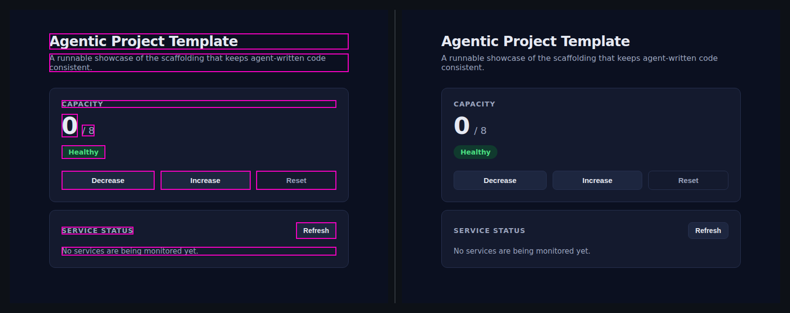

🔍 magenta boxes mark each change — changed: `h1.app__title`, `p.app__tagline`, `button.threshold-counter__button`

- **21** elements removed
- interaction states changed: `:hover`, `:focus`

Show all 16 property changes

**Removed** `div` ×3

**Removed** `main.app`

**Removed** `header`

**Removed** `h1`

**Removed** `p` ×3

**Removed** `section.threshold-counter`

**Removed** `button` ×4

**Removed** `h2` ×2

**Removed** `output` ×2

**Removed** `span` ×2

**Removed** `section.service-status`

### `div` · 21 elements added

_service-status-empty @ 768_

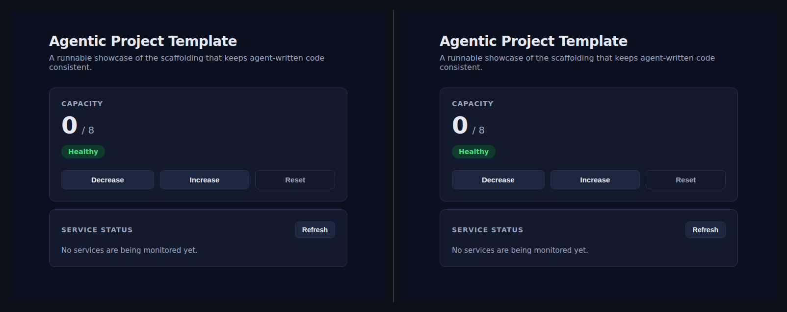

◀ before  ·  after ▶ — service-status-empty @ 768

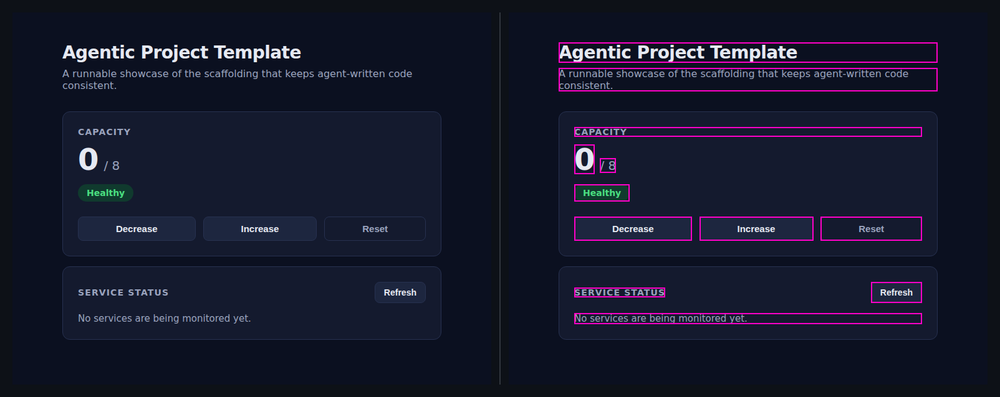

🔍 magenta boxes mark each change — changed: `h1.app__title`, `p.app__tagline`, `button.threshold-counter__button`

- **21** elements added
- interaction states changed: `:hover`, `:focus`

Show all 268 property changes

**Added** `div`

Style:

| Property | Value |
| --- | --- |
| `border-color` | `#e6e9f2` |
| `color` | `#e6e9f2` |
| `font-family` | `ui-sans-serif, system-ui, -apple-system, "Segoe UI", Roboto, sans-serif` |
| `-webkit-locale` | `"en"` |
| `box-sizing` | `border-box` |
| `row-rule-color` | `#e6e9f2` |

**Added** `main.app`

Style:

| Property | Value |
| --- | --- |
| `padding` | `48px 16px` |
| `border-color` | `#e6e9f2` |
| `color` | `#e6e9f2` |
| `font-family` | `ui-sans-serif, system-ui, -apple-system, "Segoe UI", Roboto, sans-serif` |
| `-webkit-locale` | `"en"` |
| `box-sizing` | `border-box` |
| `margin-left` | `64px` |
| `margin-right` | `64px` |
| `max-inline-size` | `640px` |
| `row-rule-color` | `#e6e9f2` |

**Added** `header`

Style:

| Property | Value |
| --- | --- |
| `border-color` | `#e6e9f2` |
| `color` | `#e6e9f2` |
| `font-family` | `ui-sans-serif, system-ui, -apple-system, "Segoe UI", Roboto, sans-serif` |
| `-webkit-locale` | `"en"` |
| `box-sizing` | `border-box` |
| `margin-bottom` | `32px` |
| `row-rule-color` | `#e6e9f2` |

**Added** `h1`

Style:

| Property | Value |
| --- | --- |
| `border-color` | `#e6e9f2` |
| `color` | `#e6e9f2` |
| `font-family` | `ui-sans-serif, system-ui, -apple-system, "Segoe UI", Roboto, sans-serif` |
| `font-size` | `28px` |
| `letter-spacing` | `-0.56px` |
| `-webkit-locale` | `"en"` |
| `box-sizing` | `border-box` |
| `margin-bottom` | `8px` |
| `margin-top` | `0px` |
| `row-rule-color` | `#e6e9f2` |

**Added** `p`

Style:

| Property | Value |
| --- | --- |
| `border-color` | `#9aa3bd` |
| `color` | `#9aa3bd` |
| `font-family` | `ui-sans-serif, system-ui, -apple-system, "Segoe UI", Roboto, sans-serif` |
| `-webkit-locale` | `"en"` |
| `box-sizing` | `border-box` |
| `margin-bottom` | `0px` |
| `margin-top` | `0px` |
| `row-rule-color` | `#9aa3bd` |

**Added** `section.threshold-counter`

Style:

| Property | Value |
| --- | --- |
| `padding` | `24px` |
| `border-width` | `1px` |
| `border-style` | `solid` |
| `border-color` | `#273150` |
| `border-radius` | `12px` |
| `background-color` | `#141a2e` |
| `color` | `#e6e9f2` |
| `font-family` | `ui-sans-serif, system-ui, -apple-system, "Segoe UI", Roboto, sans-serif` |
| `-webkit-locale` | `"en"` |
| `box-sizing` | `border-box` |
| `row-rule-color` | `#e6e9f2` |

**Added** `div`

Style:

| Property | Value |
| --- | --- |
| `display` | `flex` |
| `gap` | `12px` |
| `border-color` | `#e6e9f2` |
| `color` | `#e6e9f2` |
| `font-family` | `ui-sans-serif, system-ui, -apple-system, "Segoe UI", Roboto, sans-serif` |
| `-webkit-locale` | `"en"` |
| `box-sizing` | `border-box` |
| `flex-wrap` | `wrap` |
| `row-rule-color` | `#e6e9f2` |

**Added** `button` ×2

Style:

| Property | Value |
| --- | --- |
| `display` | `block` |
| `padding` | `10px 16px` |
| `border-width` | `1px` |
| `border-style` | `solid` |
| `border-color` | `#273150` |
| `border-radius` | `8px` |
| `background-color` | `#1d263f` |
| `color` | `#e6e9f2` |
| `font-size` | `15px` |
| `font-weight` | `600` |
| `-webkit-locale` | `"en"` |
| `cursor` | `pointer` |
| `flex-grow` | `1` |
| `min-block-size` | `auto` |
| `min-inline-size` | `96px` |
| `row-rule-color` | `#e6e9f2` |
| `transition-behavior` | `normal, normal` |
| `transition-delay` | `0s, 0s` |
| `transition-duration` | `0.12s, 0.12s` |
| `transition-property` | `background, border-color` |
| `transition-timing-function` | `ease, ease` |

Interactive states:

| State | Property | Value |
| --- | --- | --- |
| `:hover` | `border-color` | `#3a4a72` |
| `:hover` | `background-color` | `#26314f` |
| `:focus` | `outline` | `2px solid rgb(74, 222, 128)` |
| `:focus` | `outline-offset` | `2px` |

**Added** `button`

Style:

| Property | Value |
| --- | --- |
| `display` | `block` |
| `padding` | `10px 16px` |
| `border-width` | `1px` |
| `border-style` | `solid` |
| `border-color` | `#273150` |
| `border-radius` | `8px` |
| `background-color` | `transparent` |
| `color` | `#9aa3bd` |
| `font-size` | `15px` |
| `font-weight` | `600` |
| `-webkit-locale` | `"en"` |
| `cursor` | `pointer` |
| `flex-grow` | `1` |
| `min-block-size` | `auto` |
| `min-inline-size` | `96px` |
| `row-rule-color` | `#9aa3bd` |
| `transition-behavior` | `normal, normal` |
| `transition-delay` | `0s, 0s` |
| `transition-duration` | `0.12s, 0.12s` |
| `transition-property` | `background, border-color` |
| `transition-timing-function` | `ease, ease` |

Interactive states:

| State | Property | Value |
| --- | --- | --- |
| `:hover` | `border-color` | `#3a4a72` |
| `:hover` | `background-color` | `#26314f` |
| `:focus` | `outline` | `2px solid rgb(74, 222, 128)` |
| `:focus` | `outline-offset` | `2px` |

**Added** `h2`

Style:

| Property | Value |
| --- | --- |
| `border-color` | `#9aa3bd` |
| `color` | `#9aa3bd` |
| `font-family` | `ui-sans-serif, system-ui, -apple-system, "Segoe UI", Roboto, sans-serif` |
| `font-size` | `14px` |
| `letter-spacing` | `1.12px` |
| `text-transform` | `uppercase` |
| `-webkit-locale` | `"en"` |
| `box-sizing` | `border-box` |
| `margin-bottom` | `12px` |
| `margin-top` | `0px` |
| `row-rule-color` | `#9aa3bd` |

**Added** `output`

Style:

| Property | Value |
| --- | --- |
| `display` | `inline-block` |
| `padding` | `6px 14px` |
| `border-color` | `#4ade80` |
| `border-radius` | `999px` |
| `background-color` | `#103a2e` |
| `color` | `#4ade80` |
| `font-family` | `ui-sans-serif, system-ui, -apple-system, "Segoe UI", Roboto, sans-serif` |
| `font-size` | `14px` |
| `font-weight` | `600` |
| `-webkit-locale` | `"en"` |
| `box-sizing` | `border-box` |
| `margin-bottom` | `24px` |
| `row-rule-color` | `#4ade80` |

**Added** `p`

Style:

| Property | Value |
| --- | --- |
| `display` | `flex` |
| `align-items` | `baseline` |
| `gap` | `8px` |
| `border-color` | `#e6e9f2` |
| `color` | `#e6e9f2` |
| `font-family` | `ui-sans-serif, system-ui, -apple-system, "Segoe UI", Roboto, sans-serif` |
| `-webkit-locale` | `"en"` |
| `box-sizing` | `border-box` |
| `margin-top` | `0px` |
| `row-rule-color` | `#e6e9f2` |

**Added** `span`

Style:

| Property | Value |
| --- | --- |
| `display` | `block` |
| `border-color` | `#e6e9f2` |
| `color` | `#e6e9f2` |
| `font-family` | `ui-sans-serif, system-ui, -apple-system, "Segoe UI", Roboto, sans-serif` |
| `font-size` | `48px` |
| `font-weight` | `700` |
| `line-height` | `48px` |
| `-webkit-locale` | `"en"` |
| `box-sizing` | `border-box` |
| `min-block-size` | `auto` |
| `min-inline-size` | `auto` |
| `row-rule-color` | `#e6e9f2` |

**Added** `span`

Style:

| Property | Value |
| --- | --- |
| `display` | `block` |
| `border-color` | `#9aa3bd` |
| `color` | `#9aa3bd` |
| `font-family` | `ui-sans-serif, system-ui, -apple-system, "Segoe UI", Roboto, sans-serif` |
| `font-size` | `20px` |
| `-webkit-locale` | `"en"` |
| `box-sizing` | `border-box` |
| `min-block-size` | `auto` |
| `min-inline-size` | `auto` |
| `row-rule-color` | `#9aa3bd` |

**Added** `section.service-status`

Style:

| Property | Value |
| --- | --- |
| `padding` | `24px` |
| `border-width` | `1px` |
| `border-style` | `solid` |
| `border-color` | `#273150` |
| `border-radius` | `12px` |
| `background-color` | `#141a2e` |
| `color` | `#e6e9f2` |
| `font-family` | `ui-sans-serif, system-ui, -apple-system, "Segoe UI", Roboto, sans-serif` |
| `-webkit-locale` | `"en"` |
| `box-sizing` | `border-box` |
| `margin-top` | `16px` |
| `row-rule-color` | `#e6e9f2` |

**Added** `div`

Style:

| Property | Value |
| --- | --- |
| `display` | `flex` |
| `justify-content` | `space-between` |
| `align-items` | `center` |
| `gap` | `12px` |
| `border-color` | `#e6e9f2` |
| `color` | `#e6e9f2` |
| `font-family` | `ui-sans-serif, system-ui, -apple-system, "Segoe UI", Roboto, sans-serif` |
| `-webkit-locale` | `"en"` |
| `box-sizing` | `border-box` |
| `margin-bottom` | `16px` |
| `row-rule-color` | `#e6e9f2` |

**Added** `button`

Style:

| Property | Value |
| --- | --- |
| `display` | `block` |
| `padding` | `8px 14px` |
| `border-width` | `1px` |
| `border-style` | `solid` |
| `border-color` | `#273150` |
| `border-radius` | `8px` |
| `background-color` | `#1d263f` |
| `color` | `#e6e9f2` |
| `font-size` | `14px` |
| `font-weight` | `600` |
| `-webkit-locale` | `"en"` |
| `cursor` | `pointer` |
| `min-block-size` | `auto` |
| `min-inline-size` | `auto` |
| `row-rule-color` | `#e6e9f2` |
| `transition-behavior` | `normal, normal` |
| `transition-delay` | `0s, 0s` |
| `transition-duration` | `0.12s, 0.12s` |
| `transition-property` | `background, border-color` |
| `transition-timing-function` | `ease, ease` |

Interactive states:

| State | Property | Value |
| --- | --- | --- |
| `:hover` | `border-color` | `#3a4a72` |
| `:hover` | `background-color` | `#26314f` |
| `:focus` | `outline` | `2px solid rgb(74, 222, 128)` |
| `:focus` | `outline-offset` | `2px` |

**Added** `h2`

Style:

| Property | Value |
| --- | --- |
| `border-color` | `#9aa3bd` |
| `color` | `#9aa3bd` |
| `font-family` | `ui-sans-serif, system-ui, -apple-system, "Segoe UI", Roboto, sans-serif` |
| `font-size` | `14px` |
| `letter-spacing` | `1.12px` |
| `text-transform` | `uppercase` |
| `-webkit-locale` | `"en"` |
| `box-sizing` | `border-box` |
| `margin-bottom` | `0px` |
| `margin-top` | `0px` |
| `min-block-size` | `auto` |
| `min-inline-size` | `auto` |
| `row-rule-color` | `#9aa3bd` |

**Added** `output`

Style:

| Property | Value |
| --- | --- |
| `display` | `block` |
| `border-color` | `#e6e9f2` |
| `color` | `#e6e9f2` |
| `font-family` | `ui-sans-serif, system-ui, -apple-system, "Segoe UI", Roboto, sans-serif` |
| `-webkit-locale` | `"en"` |
| `box-sizing` | `border-box` |
| `row-rule-color` | `#e6e9f2` |

**Added** `p`

Style:

| Property | Value |
| --- | --- |
| `border-color` | `#9aa3bd` |
| `color` | `#9aa3bd` |
| `font-family` | `ui-sans-serif, system-ui, -apple-system, "Segoe UI", Roboto, sans-serif` |
| `font-size` | `15px` |
| `-webkit-locale` | `"en"` |
| `box-sizing` | `border-box` |
| `margin-bottom` | `0px` |
| `margin-top` | `0px` |
| `row-rule-color` | `#9aa3bd` |

### `div` · 21 elements removed

_service-status-error @ 1280_

◀ before  ·  after ▶ — service-status-error @ 1280

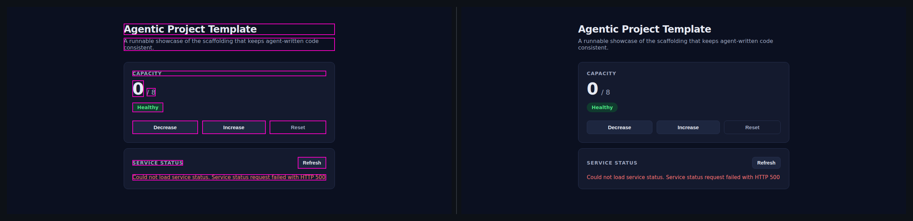

🔍 magenta boxes mark each change — changed: `h1.app__title`, `p.app__tagline`, `button.threshold-counter__button`

- **21** elements removed
- interaction states changed: `:hover`, `:focus`

Show all 16 property changes

**Removed** `div` ×3

**Removed** `main.app`

**Removed** `header`

**Removed** `h1`

**Removed** `p` ×3

**Removed** `section.threshold-counter`

**Removed** `button` ×4

**Removed** `h2` ×2

**Removed** `output` ×2

**Removed** `span` ×2

**Removed** `section.service-status`

### `div` · 21 elements added

_service-status-error @ 1280_

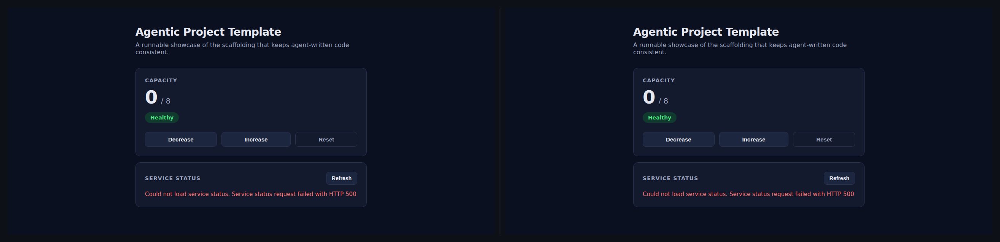

◀ before  ·  after ▶ — service-status-error @ 1280

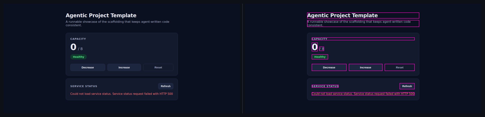

🔍 magenta boxes mark each change — changed: `h1.app__title`, `p.app__tagline`, `button.threshold-counter__button`

- **21** elements added
- interaction states changed: `:hover`, `:focus`

Show all 268 property changes

**Added** `div`

Style:

| Property | Value |
| --- | --- |
| `border-color` | `#e6e9f2` |
| `color` | `#e6e9f2` |
| `font-family` | `ui-sans-serif, system-ui, -apple-system, "Segoe UI", Roboto, sans-serif` |
| `-webkit-locale` | `"en"` |
| `box-sizing` | `border-box` |
| `row-rule-color` | `#e6e9f2` |

**Added** `main.app`

Style:

| Property | Value |
| --- | --- |
| `padding` | `48px 16px` |
| `border-color` | `#e6e9f2` |
| `color` | `#e6e9f2` |
| `font-family` | `ui-sans-serif, system-ui, -apple-system, "Segoe UI", Roboto, sans-serif` |
| `-webkit-locale` | `"en"` |
| `box-sizing` | `border-box` |
| `margin-left` | `320px` |
| `margin-right` | `320px` |
| `max-inline-size` | `640px` |
| `row-rule-color` | `#e6e9f2` |

**Added** `header`

Style:

| Property | Value |
| --- | --- |
| `border-color` | `#e6e9f2` |
| `color` | `#e6e9f2` |
| `font-family` | `ui-sans-serif, system-ui, -apple-system, "Segoe UI", Roboto, sans-serif` |
| `-webkit-locale` | `"en"` |
| `box-sizing` | `border-box` |
| `margin-bottom` | `32px` |
| `row-rule-color` | `#e6e9f2` |

**Added** `h1`

Style:

| Property | Value |
| --- | --- |
| `border-color` | `#e6e9f2` |
| `color` | `#e6e9f2` |
| `font-family` | `ui-sans-serif, system-ui, -apple-system, "Segoe UI", Roboto, sans-serif` |
| `font-size` | `28px` |
| `letter-spacing` | `-0.56px` |
| `-webkit-locale` | `"en"` |
| `box-sizing` | `border-box` |
| `margin-bottom` | `8px` |
| `margin-top` | `0px` |
| `row-rule-color` | `#e6e9f2` |

**Added** `p`

Style:

| Property | Value |
| --- | --- |
| `border-color` | `#9aa3bd` |
| `color` | `#9aa3bd` |
| `font-family` | `ui-sans-serif, system-ui, -apple-system, "Segoe UI", Roboto, sans-serif` |
| `-webkit-locale` | `"en"` |
| `box-sizing` | `border-box` |
| `margin-bottom` | `0px` |
| `margin-top` | `0px` |
| `row-rule-color` | `#9aa3bd` |

**Added** `section.threshold-counter`

Style:

| Property | Value |
| --- | --- |
| `padding` | `24px` |
| `border-width` | `1px` |
| `border-style` | `solid` |
| `border-color` | `#273150` |
| `border-radius` | `12px` |
| `background-color` | `#141a2e` |
| `color` | `#e6e9f2` |
| `font-family` | `ui-sans-serif, system-ui, -apple-system, "Segoe UI", Roboto, sans-serif` |
| `-webkit-locale` | `"en"` |
| `box-sizing` | `border-box` |
| `row-rule-color` | `#e6e9f2` |

**Added** `div`

Style:

| Property | Value |
| --- | --- |
| `display` | `flex` |
| `gap` | `12px` |
| `border-color` | `#e6e9f2` |
| `color` | `#e6e9f2` |
| `font-family` | `ui-sans-serif, system-ui, -apple-system, "Segoe UI", Roboto, sans-serif` |
| `-webkit-locale` | `"en"` |
| `box-sizing` | `border-box` |
| `flex-wrap` | `wrap` |
| `row-rule-color` | `#e6e9f2` |

**Added** `button` ×2

Style:

| Property | Value |
| --- | --- |
| `display` | `block` |
| `padding` | `10px 16px` |
| `border-width` | `1px` |
| `border-style` | `solid` |
| `border-color` | `#273150` |
| `border-radius` | `8px` |
| `background-color` | `#1d263f` |
| `color` | `#e6e9f2` |
| `font-size` | `15px` |
| `font-weight` | `600` |
| `-webkit-locale` | `"en"` |
| `cursor` | `pointer` |
| `flex-grow` | `1` |
| `min-block-size` | `auto` |
| `min-inline-size` | `96px` |
| `row-rule-color` | `#e6e9f2` |
| `transition-behavior` | `normal, normal` |
| `transition-delay` | `0s, 0s` |
| `transition-duration` | `0.12s, 0.12s` |
| `transition-property` | `background, border-color` |
| `transition-timing-function` | `ease, ease` |

Interactive states:

| State | Property | Value |
| --- | --- | --- |
| `:hover` | `border-color` | `#3a4a72` |
| `:hover` | `background-color` | `#26314f` |
| `:focus` | `outline` | `2px solid rgb(74, 222, 128)` |
| `:focus` | `outline-offset` | `2px` |

**Added** `button`

Style:

| Property | Value |
| --- | --- |
| `display` | `block` |
| `padding` | `10px 16px` |
| `border-width` | `1px` |
| `border-style` | `solid` |
| `border-color` | `#273150` |
| `border-radius` | `8px` |
| `background-color` | `transparent` |
| `color` | `#9aa3bd` |
| `font-size` | `15px` |
| `font-weight` | `600` |
| `-webkit-locale` | `"en"` |
| `cursor` | `pointer` |
| `flex-grow` | `1` |
| `min-block-size` | `auto` |
| `min-inline-size` | `96px` |
| `row-rule-color` | `#9aa3bd` |
| `transition-behavior` | `normal, normal` |
| `transition-delay` | `0s, 0s` |
| `transition-duration` | `0.12s, 0.12s` |
| `transition-property` | `background, border-color` |
| `transition-timing-function` | `ease, ease` |

Interactive states:

| State | Property | Value |
| --- | --- | --- |
| `:hover` | `border-color` | `#3a4a72` |
| `:hover` | `background-color` | `#26314f` |
| `:focus` | `outline` | `2px solid rgb(74, 222, 128)` |
| `:focus` | `outline-offset` | `2px` |

**Added** `h2`

Style:

| Property | Value |
| --- | --- |
| `border-color` | `#9aa3bd` |
| `color` | `#9aa3bd` |
| `font-family` | `ui-sans-serif, system-ui, -apple-system, "Segoe UI", Roboto, sans-serif` |
| `font-size` | `14px` |
| `letter-spacing` | `1.12px` |
| `text-transform` | `uppercase` |
| `-webkit-locale` | `"en"` |
| `box-sizing` | `border-box` |
| `margin-bottom` | `12px` |
| `margin-top` | `0px` |
| `row-rule-color` | `#9aa3bd` |

**Added** `output`

Style:

| Property | Value |
| --- | --- |
| `display` | `inline-block` |
| `padding` | `6px 14px` |
| `border-color` | `#4ade80` |
| `border-radius` | `999px` |
| `background-color` | `#103a2e` |
| `color` | `#4ade80` |
| `font-family` | `ui-sans-serif, system-ui, -apple-system, "Segoe UI", Roboto, sans-serif` |
| `font-size` | `14px` |
| `font-weight` | `600` |
| `-webkit-locale` | `"en"` |
| `box-sizing` | `border-box` |
| `margin-bottom` | `24px` |
| `row-rule-color` | `#4ade80` |

**Added** `p`

Style:

| Property | Value |
| --- | --- |
| `display` | `flex` |
| `align-items` | `baseline` |
| `gap` | `8px` |
| `border-color` | `#e6e9f2` |
| `color` | `#e6e9f2` |
| `font-family` | `ui-sans-serif, system-ui, -apple-system, "Segoe UI", Roboto, sans-serif` |
| `-webkit-locale` | `"en"` |
| `box-sizing` | `border-box` |
| `margin-top` | `0px` |
| `row-rule-color` | `#e6e9f2` |

**Added** `span`

Style:

| Property | Value |
| --- | --- |
| `display` | `block` |
| `border-color` | `#e6e9f2` |
| `color` | `#e6e9f2` |
| `font-family` | `ui-sans-serif, system-ui, -apple-system, "Segoe UI", Roboto, sans-serif` |
| `font-size` | `48px` |
| `font-weight` | `700` |
| `line-height` | `48px` |
| `-webkit-locale` | `"en"` |
| `box-sizing` | `border-box` |
| `min-block-size` | `auto` |
| `min-inline-size` | `auto` |
| `row-rule-color` | `#e6e9f2` |

**Added** `span`

Style:

| Property | Value |
| --- | --- |
| `display` | `block` |
| `border-color` | `#9aa3bd` |
| `color` | `#9aa3bd` |
| `font-family` | `ui-sans-serif, system-ui, -apple-system, "Segoe UI", Roboto, sans-serif` |
| `font-size` | `20px` |
| `-webkit-locale` | `"en"` |
| `box-sizing` | `border-box` |
| `min-block-size` | `auto` |
| `min-inline-size` | `auto` |
| `row-rule-color` | `#9aa3bd` |

**Added** `section.service-status`

Style:

| Property | Value |
| --- | --- |
| `padding` | `24px` |
| `border-width` | `1px` |
| `border-style` | `solid` |
| `border-color` | `#273150` |
| `border-radius` | `12px` |
| `background-color` | `#141a2e` |
| `color` | `#e6e9f2` |
| `font-family` | `ui-sans-serif, system-ui, -apple-system, "Segoe UI", Roboto, sans-serif` |
| `-webkit-locale` | `"en"` |
| `box-sizing` | `border-box` |
| `margin-top` | `16px` |
| `row-rule-color` | `#e6e9f2` |

**Added** `div`

Style:

| Property | Value |
| --- | --- |
| `display` | `flex` |
| `justify-content` | `space-between` |
| `align-items` | `center` |
| `gap` | `12px` |
| `border-color` | `#e6e9f2` |
| `color` | `#e6e9f2` |
| `font-family` | `ui-sans-serif, system-ui, -apple-system, "Segoe UI", Roboto, sans-serif` |
| `-webkit-locale` | `"en"` |
| `box-sizing` | `border-box` |
| `margin-bottom` | `16px` |
| `row-rule-color` | `#e6e9f2` |

**Added** `button`

Style:

| Property | Value |
| --- | --- |
| `display` | `block` |
| `padding` | `8px 14px` |
| `border-width` | `1px` |
| `border-style` | `solid` |
| `border-color` | `#273150` |
| `border-radius` | `8px` |
| `background-color` | `#1d263f` |
| `color` | `#e6e9f2` |
| `font-size` | `14px` |
| `font-weight` | `600` |
| `-webkit-locale` | `"en"` |
| `cursor` | `pointer` |
| `min-block-size` | `auto` |
| `min-inline-size` | `auto` |
| `row-rule-color` | `#e6e9f2` |
| `transition-behavior` | `normal, normal` |
| `transition-delay` | `0s, 0s` |
| `transition-duration` | `0.12s, 0.12s` |
| `transition-property` | `background, border-color` |
| `transition-timing-function` | `ease, ease` |

Interactive states:

| State | Property | Value |
| --- | --- | --- |
| `:hover` | `border-color` | `#3a4a72` |
| `:hover` | `background-color` | `#26314f` |
| `:focus` | `outline` | `2px solid rgb(74, 222, 128)` |
| `:focus` | `outline-offset` | `2px` |

**Added** `h2`

Style:

| Property | Value |
| --- | --- |
| `border-color` | `#9aa3bd` |
| `color` | `#9aa3bd` |
| `font-family` | `ui-sans-serif, system-ui, -apple-system, "Segoe UI", Roboto, sans-serif` |
| `font-size` | `14px` |
| `letter-spacing` | `1.12px` |
| `text-transform` | `uppercase` |
| `-webkit-locale` | `"en"` |
| `box-sizing` | `border-box` |
| `margin-bottom` | `0px` |
| `margin-top` | `0px` |
| `min-block-size` | `auto` |
| `min-inline-size` | `auto` |
| `row-rule-color` | `#9aa3bd` |

**Added** `output`

Style:

| Property | Value |
| --- | --- |
| `display` | `block` |
| `border-color` | `#e6e9f2` |
| `color` | `#e6e9f2` |
| `font-family` | `ui-sans-serif, system-ui, -apple-system, "Segoe UI", Roboto, sans-serif` |
| `-webkit-locale` | `"en"` |
| `box-sizing` | `border-box` |
| `row-rule-color` | `#e6e9f2` |

**Added** `p`

Style:

| Property | Value |
| --- | --- |
| `border-color` | `#f87171` |
| `color` | `#f87171` |
| `font-family` | `ui-sans-serif, system-ui, -apple-system, "Segoe UI", Roboto, sans-serif` |
| `font-size` | `15px` |
| `-webkit-locale` | `"en"` |
| `box-sizing` | `border-box` |
| `margin-bottom` | `0px` |
| `margin-top` | `0px` |
| `row-rule-color` | `#f87171` |

### `div` · 21 elements removed

_service-status-error @ 390_

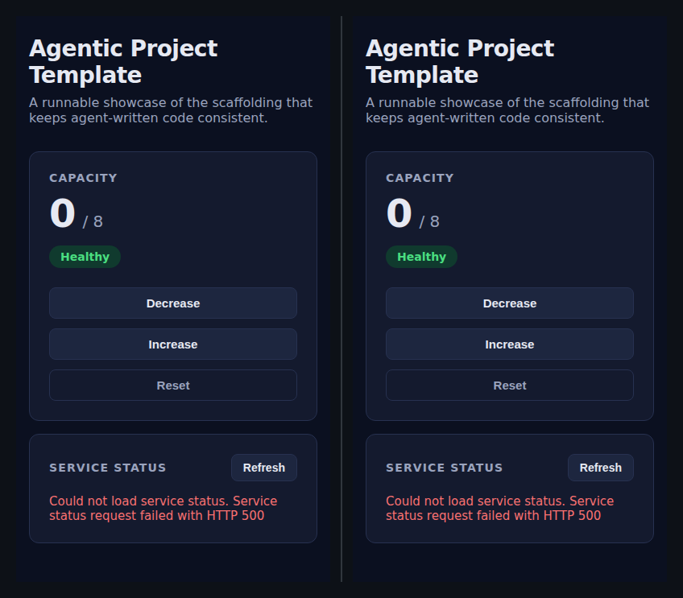

◀ before  ·  after ▶ — service-status-error @ 390

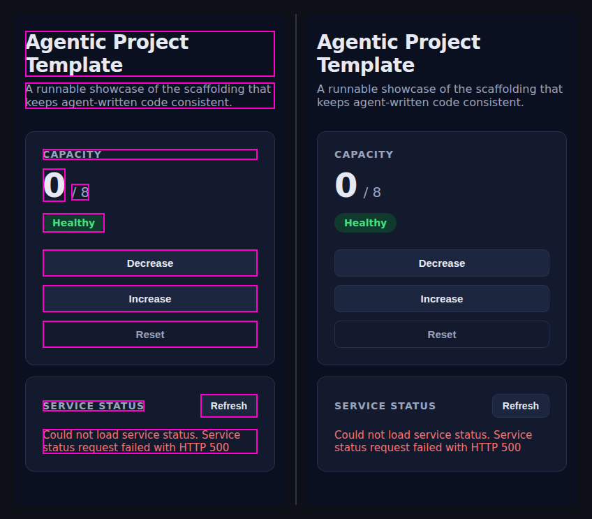

🔍 magenta boxes mark each change — changed: `h1.app__title`, `p.app__tagline`, `button.threshold-counter__button`

- **21** elements removed
- interaction states changed: `:hover`, `:focus`

Show all 16 property changes

**Removed** `div` ×3

**Removed** `main.app`

**Removed** `header`

**Removed** `h1`

**Removed** `p` ×3

**Removed** `section.threshold-counter`

**Removed** `button` ×4

**Removed** `h2` ×2

**Removed** `output` ×2

**Removed** `span` ×2

**Removed** `section.service-status`

### `div` · 21 elements added

_service-status-error @ 390_

◀ before  ·  after ▶ — service-status-error @ 390

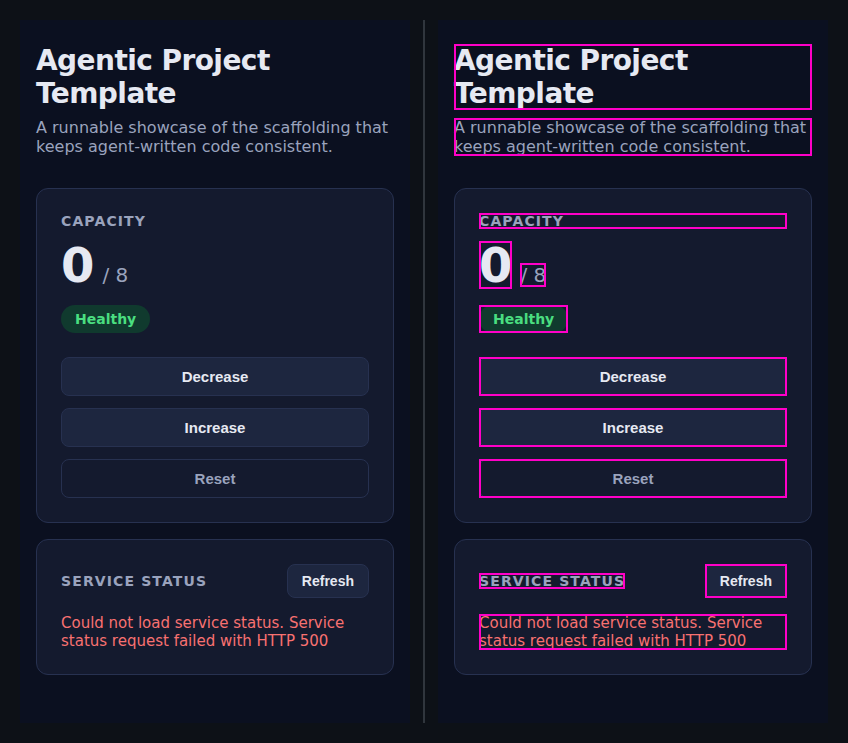

🔍 magenta boxes mark each change — changed: `h1.app__title`, `p.app__tagline`, `button.threshold-counter__button`

- **21** elements added
- interaction states changed: `:hover`, `:focus`

Show all 267 property changes

**Added** `div`

Style:

| Property | Value |
| --- | --- |
| `border-color` | `#e6e9f2` |
| `color` | `#e6e9f2` |
| `font-family` | `ui-sans-serif, system-ui, -apple-system, "Segoe UI", Roboto, sans-serif` |
| `-webkit-locale` | `"en"` |
| `box-sizing` | `border-box` |
| `row-rule-color` | `#e6e9f2` |

**Added** `main.app`

Style:

| Property | Value |
| --- | --- |
| `padding` | `24px 16px` |
| `border-color` | `#e6e9f2` |
| `color` | `#e6e9f2` |
| `font-family` | `ui-sans-serif, system-ui, -apple-system, "Segoe UI", Roboto, sans-serif` |
| `-webkit-locale` | `"en"` |
| `box-sizing` | `border-box` |
| `max-inline-size` | `640px` |
| `row-rule-color` | `#e6e9f2` |

**Added** `header`

Style:

| Property | Value |
| --- | --- |
| `border-color` | `#e6e9f2` |
| `color` | `#e6e9f2` |
| `font-family` | `ui-sans-serif, system-ui, -apple-system, "Segoe UI", Roboto, sans-serif` |
| `-webkit-locale` | `"en"` |
| `box-sizing` | `border-box` |
| `margin-bottom` | `32px` |
| `row-rule-color` | `#e6e9f2` |

**Added** `h1`

Style:

| Property | Value |
| --- | --- |
| `border-color` | `#e6e9f2` |
| `color` | `#e6e9f2` |
| `font-family` | `ui-sans-serif, system-ui, -apple-system, "Segoe UI", Roboto, sans-serif` |
| `font-size` | `28px` |
| `letter-spacing` | `-0.56px` |
| `-webkit-locale` | `"en"` |
| `box-sizing` | `border-box` |
| `margin-bottom` | `8px` |
| `margin-top` | `0px` |
| `row-rule-color` | `#e6e9f2` |

**Added** `p`

Style:

| Property | Value |
| --- | --- |
| `border-color` | `#9aa3bd` |
| `color` | `#9aa3bd` |
| `font-family` | `ui-sans-serif, system-ui, -apple-system, "Segoe UI", Roboto, sans-serif` |
| `-webkit-locale` | `"en"` |
| `box-sizing` | `border-box` |
| `margin-bottom` | `0px` |
| `margin-top` | `0px` |
| `row-rule-color` | `#9aa3bd` |

**Added** `section.threshold-counter`

Style:

| Property | Value |
| --- | --- |
| `padding` | `24px` |
| `border-width` | `1px` |
| `border-style` | `solid` |
| `border-color` | `#273150` |
| `border-radius` | `12px` |
| `background-color` | `#141a2e` |
| `color` | `#e6e9f2` |
| `font-family` | `ui-sans-serif, system-ui, -apple-system, "Segoe UI", Roboto, sans-serif` |
| `-webkit-locale` | `"en"` |
| `box-sizing` | `border-box` |
| `row-rule-color` | `#e6e9f2` |

**Added** `div`

Style:

| Property | Value |
| --- | --- |
| `display` | `flex` |
| `flex-direction` | `column` |
| `gap` | `12px` |
| `border-color` | `#e6e9f2` |
| `color` | `#e6e9f2` |
| `font-family` | `ui-sans-serif, system-ui, -apple-system, "Segoe UI", Roboto, sans-serif` |
| `-webkit-locale` | `"en"` |
| `box-sizing` | `border-box` |
| `flex-wrap` | `wrap` |
| `row-rule-color` | `#e6e9f2` |

**Added** `button` ×2

Style:

| Property | Value |
| --- | --- |
| `display` | `block` |
| `padding` | `10px 16px` |
| `border-width` | `1px` |
| `border-style` | `solid` |
| `border-color` | `#273150` |
| `border-radius` | `8px` |
| `background-color` | `#1d263f` |
| `color` | `#e6e9f2` |
| `font-size` | `15px` |
| `font-weight` | `600` |
| `-webkit-locale` | `"en"` |
| `cursor` | `pointer` |
| `flex-grow` | `1` |
| `min-block-size` | `auto` |
| `min-inline-size` | `96px` |
| `row-rule-color` | `#e6e9f2` |
| `transition-behavior` | `normal, normal` |
| `transition-delay` | `0s, 0s` |
| `transition-duration` | `0.12s, 0.12s` |
| `transition-property` | `background, border-color` |
| `transition-timing-function` | `ease, ease` |

Interactive states:

| State | Property | Value |
| --- | --- | --- |
| `:hover` | `border-color` | `#3a4a72` |
| `:hover` | `background-color` | `#26314f` |
| `:focus` | `outline` | `2px solid rgb(74, 222, 128)` |
| `:focus` | `outline-offset` | `2px` |

**Added** `button`

Style:

| Property | Value |
| --- | --- |
| `display` | `block` |
| `padding` | `10px 16px` |
| `border-width` | `1px` |
| `border-style` | `solid` |
| `border-color` | `#273150` |
| `border-radius` | `8px` |
| `background-color` | `transparent` |
| `color` | `#9aa3bd` |
| `font-size` | `15px` |
| `font-weight` | `600` |
| `-webkit-locale` | `"en"` |
| `cursor` | `pointer` |
| `flex-grow` | `1` |
| `min-block-size` | `auto` |
| `min-inline-size` | `96px` |
| `row-rule-color` | `#9aa3bd` |
| `transition-behavior` | `normal, normal` |
| `transition-delay` | `0s, 0s` |
| `transition-duration` | `0.12s, 0.12s` |
| `transition-property` | `background, border-color` |
| `transition-timing-function` | `ease, ease` |

Interactive states:

| State | Property | Value |
| --- | --- | --- |
| `:hover` | `border-color` | `#3a4a72` |
| `:hover` | `background-color` | `#26314f` |
| `:focus` | `outline` | `2px solid rgb(74, 222, 128)` |
| `:focus` | `outline-offset` | `2px` |

**Added** `h2`

Style:

| Property | Value |
| --- | --- |
| `border-color` | `#9aa3bd` |
| `color` | `#9aa3bd` |
| `font-family` | `ui-sans-serif, system-ui, -apple-system, "Segoe UI", Roboto, sans-serif` |
| `font-size` | `14px` |
| `letter-spacing` | `1.12px` |
| `text-transform` | `uppercase` |
| `-webkit-locale` | `"en"` |
| `box-sizing` | `border-box` |
| `margin-bottom` | `12px` |
| `margin-top` | `0px` |
| `row-rule-color` | `#9aa3bd` |

**Added** `output`

Style:

| Property | Value |
| --- | --- |
| `display` | `inline-block` |
| `padding` | `6px 14px` |
| `border-color` | `#4ade80` |
| `border-radius` | `999px` |
| `background-color` | `#103a2e` |
| `color` | `#4ade80` |
| `font-family` | `ui-sans-serif, system-ui, -apple-system, "Segoe UI", Roboto, sans-serif` |
| `font-size` | `14px` |
| `font-weight` | `600` |
| `-webkit-locale` | `"en"` |
| `box-sizing` | `border-box` |
| `margin-bottom` | `24px` |
| `row-rule-color` | `#4ade80` |

**Added** `p`

Style:

| Property | Value |
| --- | --- |
| `display` | `flex` |
| `align-items` | `baseline` |
| `gap` | `8px` |
| `border-color` | `#e6e9f2` |
| `color` | `#e6e9f2` |
| `font-family` | `ui-sans-serif, system-ui, -apple-system, "Segoe UI", Roboto, sans-serif` |
| `-webkit-locale` | `"en"` |
| `box-sizing` | `border-box` |
| `margin-top` | `0px` |
| `row-rule-color` | `#e6e9f2` |

**Added** `span`

Style:

| Property | Value |
| --- | --- |
| `display` | `block` |
| `border-color` | `#e6e9f2` |
| `color` | `#e6e9f2` |
| `font-family` | `ui-sans-serif, system-ui, -apple-system, "Segoe UI", Roboto, sans-serif` |
| `font-size` | `48px` |
| `font-weight` | `700` |
| `line-height` | `48px` |
| `-webkit-locale` | `"en"` |
| `box-sizing` | `border-box` |
| `min-block-size` | `auto` |
| `min-inline-size` | `auto` |
| `row-rule-color` | `#e6e9f2` |

**Added** `span`

Style:

| Property | Value |
| --- | --- |
| `display` | `block` |
| `border-color` | `#9aa3bd` |
| `color` | `#9aa3bd` |
| `font-family` | `ui-sans-serif, system-ui, -apple-system, "Segoe UI", Roboto, sans-serif` |
| `font-size` | `20px` |
| `-webkit-locale` | `"en"` |
| `box-sizing` | `border-box` |
| `min-block-size` | `auto` |
| `min-inline-size` | `auto` |
| `row-rule-color` | `#9aa3bd` |

**Added** `section.service-status`

Style:

| Property | Value |
| --- | --- |
| `padding` | `24px` |
| `border-width` | `1px` |
| `border-style` | `solid` |
| `border-color` | `#273150` |
| `border-radius` | `12px` |
| `background-color` | `#141a2e` |
| `color` | `#e6e9f2` |
| `font-family` | `ui-sans-serif, system-ui, -apple-system, "Segoe UI", Roboto, sans-serif` |
| `-webkit-locale` | `"en"` |
| `box-sizing` | `border-box` |
| `margin-top` | `16px` |
| `row-rule-color` | `#e6e9f2` |

**Added** `div`

Style:

| Property | Value |
| --- | --- |
| `display` | `flex` |
| `justify-content` | `space-between` |
| `align-items` | `center` |
| `gap` | `12px` |
| `border-color` | `#e6e9f2` |
| `color` | `#e6e9f2` |
| `font-family` | `ui-sans-serif, system-ui, -apple-system, "Segoe UI", Roboto, sans-serif` |
| `-webkit-locale` | `"en"` |
| `box-sizing` | `border-box` |
| `margin-bottom` | `16px` |
| `row-rule-color` | `#e6e9f2` |

**Added** `button`

Style:

| Property | Value |
| --- | --- |
| `display` | `block` |
| `padding` | `8px 14px` |
| `border-width` | `1px` |
| `border-style` | `solid` |
| `border-color` | `#273150` |
| `border-radius` | `8px` |
| `background-color` | `#1d263f` |
| `color` | `#e6e9f2` |
| `font-size` | `14px` |
| `font-weight` | `600` |
| `-webkit-locale` | `"en"` |
| `cursor` | `pointer` |
| `min-block-size` | `auto` |
| `min-inline-size` | `auto` |
| `row-rule-color` | `#e6e9f2` |
| `transition-behavior` | `normal, normal` |
| `transition-delay` | `0s, 0s` |
| `transition-duration` | `0.12s, 0.12s` |
| `transition-property` | `background, border-color` |
| `transition-timing-function` | `ease, ease` |

Interactive states:

| State | Property | Value |
| --- | --- | --- |
| `:hover` | `border-color` | `#3a4a72` |
| `:hover` | `background-color` | `#26314f` |
| `:focus` | `outline` | `2px solid rgb(74, 222, 128)` |
| `:focus` | `outline-offset` | `2px` |

**Added** `h2`

Style:

| Property | Value |
| --- | --- |
| `border-color` | `#9aa3bd` |
| `color` | `#9aa3bd` |
| `font-family` | `ui-sans-serif, system-ui, -apple-system, "Segoe UI", Roboto, sans-serif` |
| `font-size` | `14px` |
| `letter-spacing` | `1.12px` |
| `text-transform` | `uppercase` |
| `-webkit-locale` | `"en"` |
| `box-sizing` | `border-box` |
| `margin-bottom` | `0px` |
| `margin-top` | `0px` |
| `min-block-size` | `auto` |
| `min-inline-size` | `auto` |
| `row-rule-color` | `#9aa3bd` |

**Added** `output`

Style:

| Property | Value |
| --- | --- |
| `display` | `block` |
| `border-color` | `#e6e9f2` |
| `color` | `#e6e9f2` |
| `font-family` | `ui-sans-serif, system-ui, -apple-system, "Segoe UI", Roboto, sans-serif` |
| `-webkit-locale` | `"en"` |
| `box-sizing` | `border-box` |
| `row-rule-color` | `#e6e9f2` |

**Added** `p`

Style:

| Property | Value |
| --- | --- |
| `border-color` | `#f87171` |
| `color` | `#f87171` |
| `font-family` | `ui-sans-serif, system-ui, -apple-system, "Segoe UI", Roboto, sans-serif` |
| `font-size` | `15px` |
| `-webkit-locale` | `"en"` |
| `box-sizing` | `border-box` |
| `margin-bottom` | `0px` |
| `margin-top` | `0px` |
| `row-rule-color` | `#f87171` |

### `div` · 21 elements removed

_service-status-error @ 768_

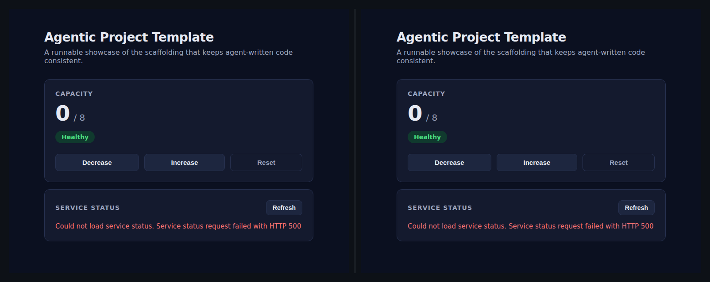

◀ before  ·  after ▶ — service-status-error @ 768

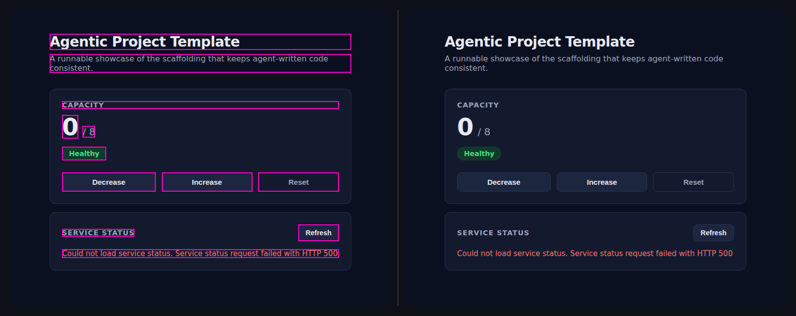

🔍 magenta boxes mark each change — changed: `h1.app__title`, `p.app__tagline`, `button.threshold-counter__button`

- **21** elements removed
- interaction states changed: `:hover`, `:focus`

Show all 16 property changes

**Removed** `div` ×3

**Removed** `main.app`

**Removed** `header`

**Removed** `h1`

**Removed** `p` ×3

**Removed** `section.threshold-counter`

**Removed** `button` ×4

**Removed** `h2` ×2

**Removed** `output` ×2

**Removed** `span` ×2

**Removed** `section.service-status`

### `div` · 21 elements added

_service-status-error @ 768_

◀ before  ·  after ▶ — service-status-error @ 768

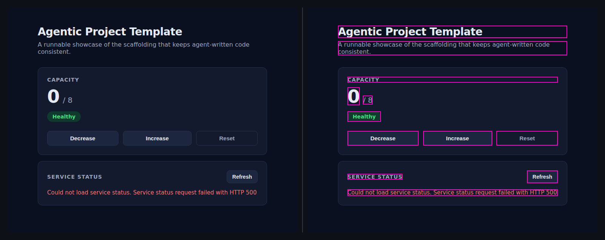

🔍 magenta boxes mark each change — changed: `h1.app__title`, `p.app__tagline`, `button.threshold-counter__button`

- **21** elements added
- interaction states changed: `:hover`, `:focus`

Show all 268 property changes

**Added** `div`

Style:

| Property | Value |
| --- | --- |
| `border-color` | `#e6e9f2` |
| `color` | `#e6e9f2` |
| `font-family` | `ui-sans-serif, system-ui, -apple-system, "Segoe UI", Roboto, sans-serif` |
| `-webkit-locale` | `"en"` |
| `box-sizing` | `border-box` |
| `row-rule-color` | `#e6e9f2` |

**Added** `main.app`

Style:

| Property | Value |
| --- | --- |
| `padding` | `48px 16px` |
| `border-color` | `#e6e9f2` |
| `color` | `#e6e9f2` |
| `font-family` | `ui-sans-serif, system-ui, -apple-system, "Segoe UI", Roboto, sans-serif` |
| `-webkit-locale` | `"en"` |
| `box-sizing` | `border-box` |
| `margin-left` | `64px` |
| `margin-right` | `64px` |
| `max-inline-size` | `640px` |
| `row-rule-color` | `#e6e9f2` |

**Added** `header`

Style:

| Property | Value |
| --- | --- |
| `border-color` | `#e6e9f2` |
| `color` | `#e6e9f2` |
| `font-family` | `ui-sans-serif, system-ui, -apple-system, "Segoe UI", Roboto, sans-serif` |
| `-webkit-locale` | `"en"` |
| `box-sizing` | `border-box` |
| `margin-bottom` | `32px` |
| `row-rule-color` | `#e6e9f2` |

**Added** `h1`

Style:

| Property | Value |
| --- | --- |
| `border-color` | `#e6e9f2` |
| `color` | `#e6e9f2` |
| `font-family` | `ui-sans-serif, system-ui, -apple-system, "Segoe UI", Roboto, sans-serif` |
| `font-size` | `28px` |
| `letter-spacing` | `-0.56px` |
| `-webkit-locale` | `"en"` |
| `box-sizing` | `border-box` |
| `margin-bottom` | `8px` |
| `margin-top` | `0px` |
| `row-rule-color` | `#e6e9f2` |

**Added** `p`

Style:

| Property | Value |
| --- | --- |
| `border-color` | `#9aa3bd` |
| `color` | `#9aa3bd` |
| `font-family` | `ui-sans-serif, system-ui, -apple-system, "Segoe UI", Roboto, sans-serif` |
| `-webkit-locale` | `"en"` |
| `box-sizing` | `border-box` |
| `margin-bottom` | `0px` |
| `margin-top` | `0px` |
| `row-rule-color` | `#9aa3bd` |

**Added** `section.threshold-counter`

Style:

| Property | Value |
| --- | --- |
| `padding` | `24px` |
| `border-width` | `1px` |
| `border-style` | `solid` |
| `border-color` | `#273150` |
| `border-radius` | `12px` |
| `background-color` | `#141a2e` |
| `color` | `#e6e9f2` |
| `font-family` | `ui-sans-serif, system-ui, -apple-system, "Segoe UI", Roboto, sans-serif` |
| `-webkit-locale` | `"en"` |
| `box-sizing` | `border-box` |
| `row-rule-color` | `#e6e9f2` |

**Added** `div`

Style:

| Property | Value |
| --- | --- |
| `display` | `flex` |
| `gap` | `12px` |
| `border-color` | `#e6e9f2` |
| `color` | `#e6e9f2` |
| `font-family` | `ui-sans-serif, system-ui, -apple-system, "Segoe UI", Roboto, sans-serif` |
| `-webkit-locale` | `"en"` |
| `box-sizing` | `border-box` |
| `flex-wrap` | `wrap` |
| `row-rule-color` | `#e6e9f2` |

**Added** `button` ×2

Style:

| Property | Value |
| --- | --- |
| `display` | `block` |
| `padding` | `10px 16px` |
| `border-width` | `1px` |
| `border-style` | `solid` |
| `border-color` | `#273150` |
| `border-radius` | `8px` |
| `background-color` | `#1d263f` |
| `color` | `#e6e9f2` |
| `font-size` | `15px` |
| `font-weight` | `600` |
| `-webkit-locale` | `"en"` |
| `cursor` | `pointer` |
| `flex-grow` | `1` |
| `min-block-size` | `auto` |
| `min-inline-size` | `96px` |
| `row-rule-color` | `#e6e9f2` |
| `transition-behavior` | `normal, normal` |
| `transition-delay` | `0s, 0s` |
| `transition-duration` | `0.12s, 0.12s` |
| `transition-property` | `background, border-color` |
| `transition-timing-function` | `ease, ease` |

Interactive states:

| State | Property | Value |
| --- | --- | --- |
| `:hover` | `border-color` | `#3a4a72` |
| `:hover` | `background-color` | `#26314f` |
| `:focus` | `outline` | `2px solid rgb(74, 222, 128)` |
| `:focus` | `outline-offset` | `2px` |

**Added** `button`

Style:

| Property | Value |
| --- | --- |
| `display` | `block` |
| `padding` | `10px 16px` |
| `border-width` | `1px` |
| `border-style` | `solid` |
| `border-color` | `#273150` |
| `border-radius` | `8px` |
| `background-color` | `transparent` |
| `color` | `#9aa3bd` |
| `font-size` | `15px` |
| `font-weight` | `600` |
| `-webkit-locale` | `"en"` |
| `cursor` | `pointer` |
| `flex-grow` | `1` |
| `min-block-size` | `auto` |
| `min-inline-size` | `96px` |
| `row-rule-color` | `#9aa3bd` |
| `transition-behavior` | `normal, normal` |
| `transition-delay` | `0s, 0s` |
| `transition-duration` | `0.12s, 0.12s` |
| `transition-property` | `background, border-color` |
| `transition-timing-function` | `ease, ease` |

Interactive states:

| State | Property | Value |
| --- | --- | --- |
| `:hover` | `border-color` | `#3a4a72` |
| `:hover` | `background-color` | `#26314f` |
| `:focus` | `outline` | `2px solid rgb(74, 222, 128)` |
| `:focus` | `outline-offset` | `2px` |

**Added** `h2`

Style:

| Property | Value |
| --- | --- |
| `border-color` | `#9aa3bd` |
| `color` | `#9aa3bd` |
| `font-family` | `ui-sans-serif, system-ui, -apple-system, "Segoe UI", Roboto, sans-serif` |
| `font-size` | `14px` |
| `letter-spacing` | `1.12px` |
| `text-transform` | `uppercase` |
| `-webkit-locale` | `"en"` |
| `box-sizing` | `border-box` |
| `margin-bottom` | `12px` |
| `margin-top` | `0px` |
| `row-rule-color` | `#9aa3bd` |

**Added** `output`

Style:

| Property | Value |
| --- | --- |
| `display` | `inline-block` |
| `padding` | `6px 14px` |
| `border-color` | `#4ade80` |
| `border-radius` | `999px` |
| `background-color` | `#103a2e` |
| `color` | `#4ade80` |
| `font-family` | `ui-sans-serif, system-ui, -apple-system, "Segoe UI", Roboto, sans-serif` |
| `font-size` | `14px` |
| `font-weight` | `600` |
| `-webkit-locale` | `"en"` |
| `box-sizing` | `border-box` |
| `margin-bottom` | `24px` |
| `row-rule-color` | `#4ade80` |

**Added** `p`

Style:

| Property | Value |
| --- | --- |
| `display` | `flex` |
| `align-items` | `baseline` |
| `gap` | `8px` |
| `border-color` | `#e6e9f2` |
| `color` | `#e6e9f2` |
| `font-family` | `ui-sans-serif, system-ui, -apple-system, "Segoe UI", Roboto, sans-serif` |
| `-webkit-locale` | `"en"` |
| `box-sizing` | `border-box` |
| `margin-top` | `0px` |
| `row-rule-color` | `#e6e9f2` |

**Added** `span`

Style:

| Property | Value |
| --- | --- |
| `display` | `block` |
| `border-color` | `#e6e9f2` |
| `color` | `#e6e9f2` |
| `font-family` | `ui-sans-serif, system-ui, -apple-system, "Segoe UI", Roboto, sans-serif` |
| `font-size` | `48px` |
| `font-weight` | `700` |
| `line-height` | `48px` |
| `-webkit-locale` | `"en"` |
| `box-sizing` | `border-box` |
| `min-block-size` | `auto` |
| `min-inline-size` | `auto` |
| `row-rule-color` | `#e6e9f2` |

**Added** `span`

Style:

| Property | Value |
| --- | --- |
| `display` | `block` |
| `border-color` | `#9aa3bd` |
| `color` | `#9aa3bd` |
| `font-family` | `ui-sans-serif, system-ui, -apple-system, "Segoe UI", Roboto, sans-serif` |
| `font-size` | `20px` |
| `-webkit-locale` | `"en"` |
| `box-sizing` | `border-box` |
| `min-block-size` | `auto` |
| `min-inline-size` | `auto` |
| `row-rule-color` | `#9aa3bd` |

**Added** `section.service-status`

Style:

| Property | Value |
| --- | --- |
| `padding` | `24px` |
| `border-width` | `1px` |
| `border-style` | `solid` |
| `border-color` | `#273150` |
| `border-radius` | `12px` |
| `background-color` | `#141a2e` |
| `color` | `#e6e9f2` |
| `font-family` | `ui-sans-serif, system-ui, -apple-system, "Segoe UI", Roboto, sans-serif` |
| `-webkit-locale` | `"en"` |
| `box-sizing` | `border-box` |
| `margin-top` | `16px` |
| `row-rule-color` | `#e6e9f2` |

**Added** `div`

Style:

| Property | Value |
| --- | --- |
| `display` | `flex` |
| `justify-content` | `space-between` |
| `align-items` | `center` |
| `gap` | `12px` |
| `border-color` | `#e6e9f2` |
| `color` | `#e6e9f2` |
| `font-family` | `ui-sans-serif, system-ui, -apple-system, "Segoe UI", Roboto, sans-serif` |
| `-webkit-locale` | `"en"` |
| `box-sizing` | `border-box` |
| `margin-bottom` | `16px` |
| `row-rule-color` | `#e6e9f2` |

**Added** `button`

Style:

| Property | Value |
| --- | --- |
| `display` | `block` |
| `padding` | `8px 14px` |
| `border-width` | `1px` |
| `border-style` | `solid` |
| `border-color` | `#273150` |
| `border-radius` | `8px` |
| `background-color` | `#1d263f` |
| `color` | `#e6e9f2` |
| `font-size` | `14px` |
| `font-weight` | `600` |
| `-webkit-locale` | `"en"` |
| `cursor` | `pointer` |
| `min-block-size` | `auto` |
| `min-inline-size` | `auto` |
| `row-rule-color` | `#e6e9f2` |
| `transition-behavior` | `normal, normal` |
| `transition-delay` | `0s, 0s` |
| `transition-duration` | `0.12s, 0.12s` |
| `transition-property` | `background, border-color` |
| `transition-timing-function` | `ease, ease` |

Interactive states:

| State | Property | Value |
| --- | --- | --- |
| `:hover` | `border-color` | `#3a4a72` |
| `:hover` | `background-color` | `#26314f` |
| `:focus` | `outline` | `2px solid rgb(74, 222, 128)` |
| `:focus` | `outline-offset` | `2px` |

**Added** `h2`

Style:

| Property | Value |
| --- | --- |
| `border-color` | `#9aa3bd` |
| `color` | `#9aa3bd` |
| `font-family` | `ui-sans-serif, system-ui, -apple-system, "Segoe UI", Roboto, sans-serif` |
| `font-size` | `14px` |
| `letter-spacing` | `1.12px` |
| `text-transform` | `uppercase` |
| `-webkit-locale` | `"en"` |
| `box-sizing` | `border-box` |
| `margin-bottom` | `0px` |
| `margin-top` | `0px` |
| `min-block-size` | `auto` |
| `min-inline-size` | `auto` |
| `row-rule-color` | `#9aa3bd` |

**Added** `output`

Style:

| Property | Value |
| --- | --- |
| `display` | `block` |
| `border-color` | `#e6e9f2` |
| `color` | `#e6e9f2` |
| `font-family` | `ui-sans-serif, system-ui, -apple-system, "Segoe UI", Roboto, sans-serif` |
| `-webkit-locale` | `"en"` |
| `box-sizing` | `border-box` |
| `row-rule-color` | `#e6e9f2` |

**Added** `p`

Style:

| Property | Value |
| --- | --- |
| `border-color` | `#f87171` |
| `color` | `#f87171` |
| `font-family` | `ui-sans-serif, system-ui, -apple-system, "Segoe UI", Roboto, sans-serif` |
| `font-size` | `15px` |
| `-webkit-locale` | `"en"` |
| `box-sizing` | `border-box` |
| `margin-bottom` | `0px` |
| `margin-top` | `0px` |
| `row-rule-color` | `#f87171` |

### `div` · 30 elements removed

_Identical across 2 surfaces: service-status-success @ 1280 · threshold-counter @ 1280_

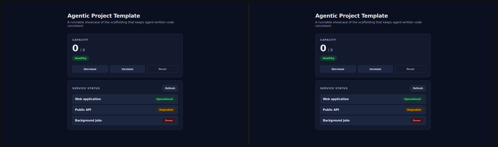

◀ before  ·  after ▶ — service-status-success @ 1280

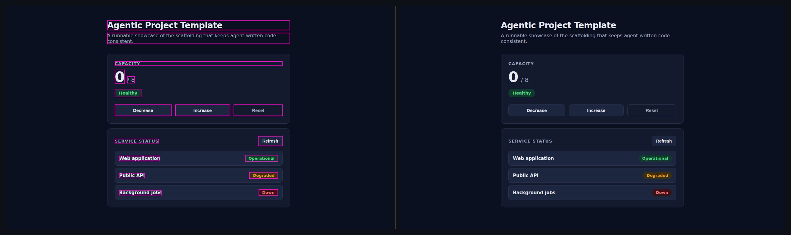

🔍 magenta boxes mark each change — changed: `h1.app__title`, `p.app__tagline`, `button.threshold-counter__button`

- **30** elements removed
- interaction states changed: `:hover`, `:focus`

Show all 16 property changes

**Removed** `div` ×3

**Removed** `main.app`

**Removed** `header`

**Removed** `h1`

**Removed** `p` ×2

**Removed** `section.threshold-counter`

**Removed** `button` ×4

**Removed** `h2` ×2

**Removed** `output` ×2

**Removed** `span` ×8

**Removed** `section.service-status`

**Removed** `ul`

**Removed** `li` ×3

### `div` · 30 elements added

_Identical across 2 surfaces: service-status-success @ 1280 · threshold-counter @ 1280_

◀ before  ·  after ▶ — service-status-success @ 1280

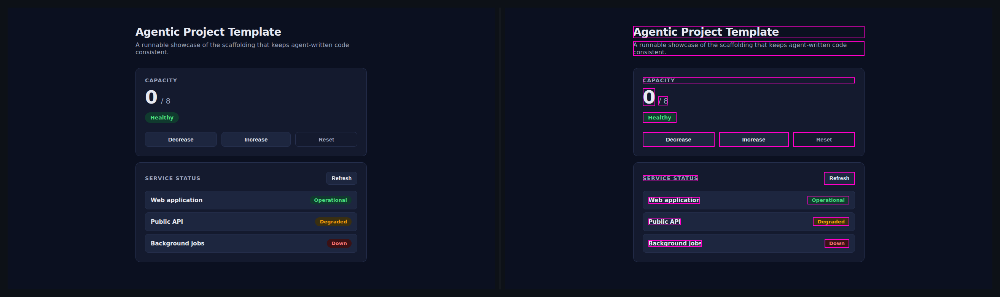

🔍 magenta boxes mark each change — changed: `h1.app__title`, `p.app__tagline`, `button.threshold-counter__button`

- **30** elements added
- interaction states changed: `:hover`, `:focus`

Show all 410 property changes

**Added** `div`

Style:

| Property | Value |
| --- | --- |
| `border-color` | `#e6e9f2` |
| `color` | `#e6e9f2` |
| `font-family` | `ui-sans-serif, system-ui, -apple-system, "Segoe UI", Roboto, sans-serif` |
| `-webkit-locale` | `"en"` |
| `box-sizing` | `border-box` |
| `row-rule-color` | `#e6e9f2` |

**Added** `main.app`

Style:

| Property | Value |
| --- | --- |
| `padding` | `48px 16px` |
| `border-color` | `#e6e9f2` |
| `color` | `#e6e9f2` |
| `font-family` | `ui-sans-serif, system-ui, -apple-system, "Segoe UI", Roboto, sans-serif` |
| `-webkit-locale` | `"en"` |
| `box-sizing` | `border-box` |
| `margin-left` | `320px` |
| `margin-right` | `320px` |
| `max-inline-size` | `640px` |
| `row-rule-color` | `#e6e9f2` |

**Added** `header`

Style:

| Property | Value |
| --- | --- |
| `border-color` | `#e6e9f2` |
| `color` | `#e6e9f2` |
| `font-family` | `ui-sans-serif, system-ui, -apple-system, "Segoe UI", Roboto, sans-serif` |
| `-webkit-locale` | `"en"` |
| `box-sizing` | `border-box` |
| `margin-bottom` | `32px` |
| `row-rule-color` | `#e6e9f2` |

**Added** `h1`

Style:

| Property | Value |
| --- | --- |
| `border-color` | `#e6e9f2` |
| `color` | `#e6e9f2` |
| `font-family` | `ui-sans-serif, system-ui, -apple-system, "Segoe UI", Roboto, sans-serif` |
| `font-size` | `28px` |
| `letter-spacing` | `-0.56px` |
| `-webkit-locale` | `"en"` |
| `box-sizing` | `border-box` |
| `margin-bottom` | `8px` |
| `margin-top` | `0px` |
| `row-rule-color` | `#e6e9f2` |

**Added** `p`

Style:

| Property | Value |
| --- | --- |
| `border-color` | `#9aa3bd` |
| `color` | `#9aa3bd` |
| `font-family` | `ui-sans-serif, system-ui, -apple-system, "Segoe UI", Roboto, sans-serif` |
| `-webkit-locale` | `"en"` |
| `box-sizing` | `border-box` |
| `margin-bottom` | `0px` |
| `margin-top` | `0px` |
| `row-rule-color` | `#9aa3bd` |

**Added** `section.threshold-counter`

Style:

| Property | Value |
| --- | --- |
| `padding` | `24px` |
| `border-width` | `1px` |
| `border-style` | `solid` |
| `border-color` | `#273150` |
| `border-radius` | `12px` |
| `background-color` | `#141a2e` |
| `color` | `#e6e9f2` |
| `font-family` | `ui-sans-serif, system-ui, -apple-system, "Segoe UI", Roboto, sans-serif` |
| `-webkit-locale` | `"en"` |
| `box-sizing` | `border-box` |
| `row-rule-color` | `#e6e9f2` |

**Added** `div`

Style:

| Property | Value |
| --- | --- |
| `display` | `flex` |
| `gap` | `12px` |
| `border-color` | `#e6e9f2` |
| `color` | `#e6e9f2` |
| `font-family` | `ui-sans-serif, system-ui, -apple-system, "Segoe UI", Roboto, sans-serif` |
| `-webkit-locale` | `"en"` |
| `box-sizing` | `border-box` |
| `flex-wrap` | `wrap` |
| `row-rule-color` | `#e6e9f2` |

**Added** `button` ×2

Style:

| Property | Value |
| --- | --- |
| `display` | `block` |
| `padding` | `10px 16px` |
| `border-width` | `1px` |
| `border-style` | `solid` |
| `border-color` | `#273150` |
| `border-radius` | `8px` |
| `background-color` | `#1d263f` |
| `color` | `#e6e9f2` |
| `font-size` | `15px` |
| `font-weight` | `600` |
| `-webkit-locale` | `"en"` |
| `cursor` | `pointer` |
| `flex-grow` | `1` |
| `min-block-size` | `auto` |
| `min-inline-size` | `96px` |
| `row-rule-color` | `#e6e9f2` |
| `transition-behavior` | `normal, normal` |
| `transition-delay` | `0s, 0s` |
| `transition-duration` | `0.12s, 0.12s` |
| `transition-property` | `background, border-color` |
| `transition-timing-function` | `ease, ease` |

Interactive states:

| State | Property | Value |
| --- | --- | --- |
| `:hover` | `border-color` | `#3a4a72` |
| `:hover` | `background-color` | `#26314f` |
| `:focus` | `outline` | `2px solid rgb(74, 222, 128)` |
| `:focus` | `outline-offset` | `2px` |

**Added** `button`

Style:

| Property | Value |
| --- | --- |
| `display` | `block` |
| `padding` | `10px 16px` |
| `border-width` | `1px` |
| `border-style` | `solid` |
| `border-color` | `#273150` |
| `border-radius` | `8px` |
| `background-color` | `transparent` |
| `color` | `#9aa3bd` |
| `font-size` | `15px` |
| `font-weight` | `600` |
| `-webkit-locale` | `"en"` |
| `cursor` | `pointer` |
| `flex-grow` | `1` |
| `min-block-size` | `auto` |
| `min-inline-size` | `96px` |
| `row-rule-color` | `#9aa3bd` |
| `transition-behavior` | `normal, normal` |
| `transition-delay` | `0s, 0s` |
| `transition-duration` | `0.12s, 0.12s` |
| `transition-property` | `background, border-color` |
| `transition-timing-function` | `ease, ease` |

Interactive states:

| State | Property | Value |
| --- | --- | --- |
| `:hover` | `border-color` | `#3a4a72` |
| `:hover` | `background-color` | `#26314f` |
| `:focus` | `outline` | `2px solid rgb(74, 222, 128)` |
| `:focus` | `outline-offset` | `2px` |

**Added** `h2`

Style:

| Property | Value |
| --- | --- |
| `border-color` | `#9aa3bd` |
| `color` | `#9aa3bd` |
| `font-family` | `ui-sans-serif, system-ui, -apple-system, "Segoe UI", Roboto, sans-serif` |
| `font-size` | `14px` |
| `letter-spacing` | `1.12px` |
| `text-transform` | `uppercase` |
| `-webkit-locale` | `"en"` |
| `box-sizing` | `border-box` |
| `margin-bottom` | `12px` |
| `margin-top` | `0px` |
| `row-rule-color` | `#9aa3bd` |

**Added** `output`

Style:

| Property | Value |
| --- | --- |
| `display` | `inline-block` |
| `padding` | `6px 14px` |
| `border-color` | `#4ade80` |
| `border-radius` | `999px` |
| `background-color` | `#103a2e` |
| `color` | `#4ade80` |
| `font-family` | `ui-sans-serif, system-ui, -apple-system, "Segoe UI", Roboto, sans-serif` |
| `font-size` | `14px` |
| `font-weight` | `600` |
| `-webkit-locale` | `"en"` |
| `box-sizing` | `border-box` |
| `margin-bottom` | `24px` |
| `row-rule-color` | `#4ade80` |

**Added** `p`

Style:

| Property | Value |
| --- | --- |
| `display` | `flex` |
| `align-items` | `baseline` |
| `gap` | `8px` |
| `border-color` | `#e6e9f2` |
| `color` | `#e6e9f2` |
| `font-family` | `ui-sans-serif, system-ui, -apple-system, "Segoe UI", Roboto, sans-serif` |
| `-webkit-locale` | `"en"` |
| `box-sizing` | `border-box` |
| `margin-top` | `0px` |
| `row-rule-color` | `#e6e9f2` |

**Added** `span`

Style:

| Property | Value |
| --- | --- |
| `display` | `block` |
| `border-color` | `#e6e9f2` |
| `color` | `#e6e9f2` |
| `font-family` | `ui-sans-serif, system-ui, -apple-system, "Segoe UI", Roboto, sans-serif` |
| `font-size` | `48px` |
| `font-weight` | `700` |
| `line-height` | `48px` |
| `-webkit-locale` | `"en"` |
| `box-sizing` | `border-box` |
| `min-block-size` | `auto` |
| `min-inline-size` | `auto` |
| `row-rule-color` | `#e6e9f2` |

**Added** `span`

Style:

| Property | Value |
| --- | --- |
| `display` | `block` |
| `border-color` | `#9aa3bd` |
| `color` | `#9aa3bd` |
| `font-family` | `ui-sans-serif, system-ui, -apple-system, "Segoe UI", Roboto, sans-serif` |
| `font-size` | `20px` |
| `-webkit-locale` | `"en"` |
| `box-sizing` | `border-box` |
| `min-block-size` | `auto` |
| `min-inline-size` | `auto` |
| `row-rule-color` | `#9aa3bd` |

**Added** `section.service-status`

Style:

| Property | Value |
| --- | --- |
| `padding` | `24px` |
| `border-width` | `1px` |
| `border-style` | `solid` |
| `border-color` | `#273150` |
| `border-radius` | `12px` |
| `background-color` | `#141a2e` |
| `color` | `#e6e9f2` |
| `font-family` | `ui-sans-serif, system-ui, -apple-system, "Segoe UI", Roboto, sans-serif` |
| `-webkit-locale` | `"en"` |
| `box-sizing` | `border-box` |
| `margin-top` | `16px` |
| `row-rule-color` | `#e6e9f2` |

**Added** `div`

Style:

| Property | Value |
| --- | --- |
| `display` | `flex` |
| `justify-content` | `space-between` |
| `align-items` | `center` |
| `gap` | `12px` |
| `border-color` | `#e6e9f2` |
| `color` | `#e6e9f2` |
| `font-family` | `ui-sans-serif, system-ui, -apple-system, "Segoe UI", Roboto, sans-serif` |
| `-webkit-locale` | `"en"` |
| `box-sizing` | `border-box` |
| `margin-bottom` | `16px` |
| `row-rule-color` | `#e6e9f2` |

**Added** `button`

Style:

| Property | Value |
| --- | --- |
| `display` | `block` |
| `padding` | `8px 14px` |
| `border-width` | `1px` |
| `border-style` | `solid` |
| `border-color` | `#273150` |
| `border-radius` | `8px` |
| `background-color` | `#1d263f` |
| `color` | `#e6e9f2` |
| `font-size` | `14px` |
| `font-weight` | `600` |
| `-webkit-locale` | `"en"` |
| `cursor` | `pointer` |
| `min-block-size` | `auto` |
| `min-inline-size` | `auto` |
| `row-rule-color` | `#e6e9f2` |
| `transition-behavior` | `normal, normal` |
| `transition-delay` | `0s, 0s` |
| `transition-duration` | `0.12s, 0.12s` |
| `transition-property` | `background, border-color` |
| `transition-timing-function` | `ease, ease` |

Interactive states:

| State | Property | Value |
| --- | --- | --- |
| `:hover` | `border-color` | `#3a4a72` |
| `:hover` | `background-color` | `#26314f` |
| `:focus` | `outline` | `2px solid rgb(74, 222, 128)` |
| `:focus` | `outline-offset` | `2px` |

**Added** `h2`

Style:

| Property | Value |
| --- | --- |
| `border-color` | `#9aa3bd` |
| `color` | `#9aa3bd` |
| `font-family` | `ui-sans-serif, system-ui, -apple-system, "Segoe UI", Roboto, sans-serif` |
| `font-size` | `14px` |
| `letter-spacing` | `1.12px` |
| `text-transform` | `uppercase` |
| `-webkit-locale` | `"en"` |
| `box-sizing` | `border-box` |
| `margin-bottom` | `0px` |
| `margin-top` | `0px` |
| `min-block-size` | `auto` |
| `min-inline-size` | `auto` |
| `row-rule-color` | `#9aa3bd` |

**Added** `output`

Style:

| Property | Value |
| --- | --- |
| `display` | `block` |
| `border-color` | `#e6e9f2` |
| `color` | `#e6e9f2` |
| `font-family` | `ui-sans-serif, system-ui, -apple-system, "Segoe UI", Roboto, sans-serif` |
| `-webkit-locale` | `"en"` |
| `box-sizing` | `border-box` |
| `row-rule-color` | `#e6e9f2` |

**Added** `ul`

Style:

| Property | Value |
| --- | --- |
| `display` | `flex` |
| `flex-direction` | `column` |
| `gap` | `8px` |
| `border-color` | `#e6e9f2` |
| `color` | `#e6e9f2` |
| `font-family` | `ui-sans-serif, system-ui, -apple-system, "Segoe UI", Roboto, sans-serif` |
| `-webkit-locale` | `"en"` |
| `box-sizing` | `border-box` |
| `list-style-type` | `none` |
| `margin-bottom` | `0px` |
| `margin-top` | `0px` |
| `padding-left` | `0px` |
| `row-rule-color` | `#e6e9f2` |

**Added** `li` ×3

Style:

| Property | Value |
| --- | --- |
| `display` | `flex` |
| `justify-content` | `space-between` |
| `align-items` | `center` |
| `gap` | `12px` |
| `padding` | `12px 14px` |
| `border-width` | `1px` |
| `border-style` | `solid` |
| `border-color` | `#273150` |
| `border-radius` | `8px` |
| `background-color` | `#1d263f` |
| `color` | `#e6e9f2` |
| `font-family` | `ui-sans-serif, system-ui, -apple-system, "Segoe UI", Roboto, sans-serif` |
| `-webkit-locale` | `"en"` |
| `box-sizing` | `border-box` |
| `list-style-position` | `outside` |
| `list-style-type` | `none` |
| `min-block-size` | `auto` |
| `min-inline-size` | `auto` |
| `row-rule-color` | `#e6e9f2` |

**Added** `span` ×3

Style:

| Property | Value |
| --- | --- |
| `display` | `block` |
| `border-color` | `#e6e9f2` |
| `color` | `#e6e9f2` |
| `font-family` | `ui-sans-serif, system-ui, -apple-system, "Segoe UI", Roboto, sans-serif` |
| `font-size` | `15px` |
| `font-weight` | `600` |
| `-webkit-locale` | `"en"` |
| `box-sizing` | `border-box` |
| `list-style-type` | `none` |
| `min-block-size` | `auto` |
| `min-inline-size` | `auto` |
| `row-rule-color` | `#e6e9f2` |

**Added** `span`

Style:

| Property | Value |
| --- | --- |
| `display` | `block` |
| `padding` | `4px 12px` |
| `border-color` | `#4ade80` |
| `border-radius` | `999px` |
| `background-color` | `#103a2e` |
| `color` | `#4ade80` |
| `font-family` | `ui-sans-serif, system-ui, -apple-system, "Segoe UI", Roboto, sans-serif` |
| `font-size` | `13px` |
| `font-weight` | `600` |
| `-webkit-locale` | `"en"` |
| `box-sizing` | `border-box` |
| `list-style-type` | `none` |
| `min-block-size` | `auto` |
| `min-inline-size` | `auto` |
| `row-rule-color` | `#4ade80` |

**Added** `span`

Style:

| Property | Value |
| --- | --- |
| `display` | `block` |
| `padding` | `4px 12px` |
| `border-color` | `#f59e0b` |
| `border-radius` | `999px` |
| `background-color` | `#3a2f10` |
| `color` | `#f59e0b` |
| `font-family` | `ui-sans-serif, system-ui, -apple-system, "Segoe UI", Roboto, sans-serif` |
| `font-size` | `13px` |
| `font-weight` | `600` |
| `-webkit-locale` | `"en"` |
| `box-sizing` | `border-box` |
| `list-style-type` | `none` |
| `min-block-size` | `auto` |
| `min-inline-size` | `auto` |
| `row-rule-color` | `#f59e0b` |

**Added** `span`

Style:

| Property | Value |
| --- | --- |
| `display` | `block` |
| `padding` | `4px 12px` |
| `border-color` | `#f87171` |
| `border-radius` | `999px` |
| `background-color` | `#3a1115` |
| `color` | `#f87171` |
| `font-family` | `ui-sans-serif, system-ui, -apple-system, "Segoe UI", Roboto, sans-serif` |
| `font-size` | `13px` |
| `font-weight` | `600` |
| `-webkit-locale` | `"en"` |
| `box-sizing` | `border-box` |
| `list-style-type` | `none` |
| `min-block-size` | `auto` |
| `min-inline-size` | `auto` |
| `row-rule-color` | `#f87171` |

### `div` · 30 elements removed

_Identical across 2 surfaces: service-status-success @ 390 · threshold-counter @ 390_

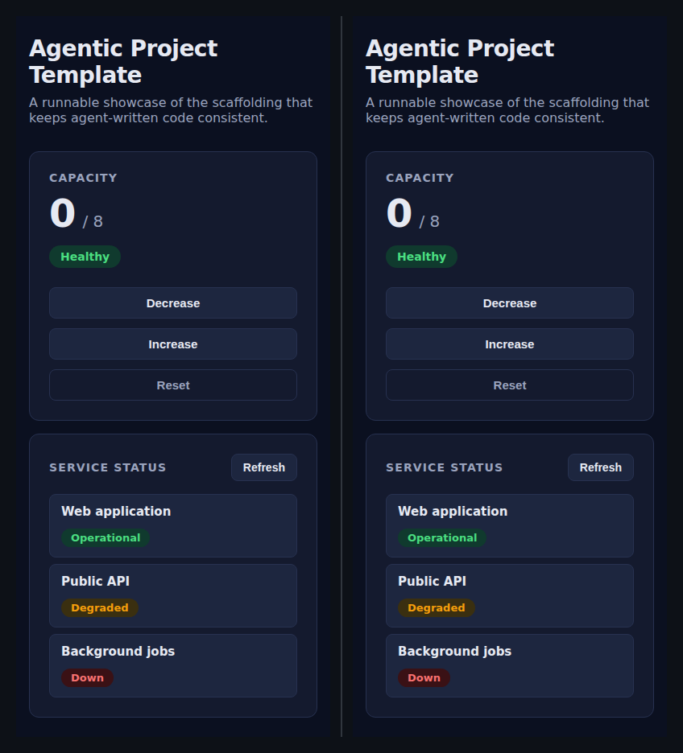

◀ before  ·  after ▶ — service-status-success @ 390

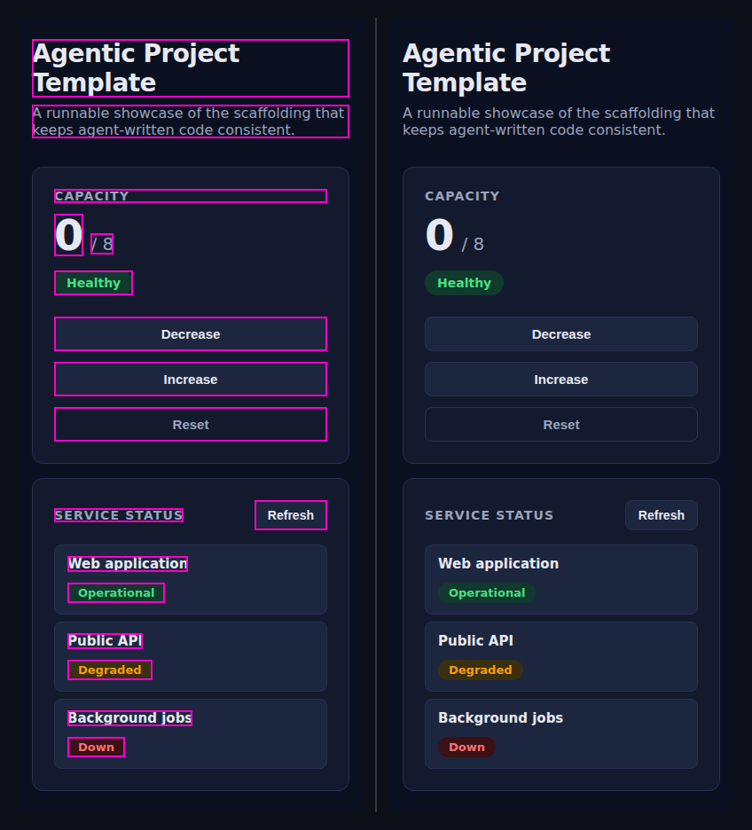

🔍 magenta boxes mark each change — changed: `h1.app__title`, `p.app__tagline`, `button.threshold-counter__button`

- **30** elements removed
- interaction states changed: `:hover`, `:focus`

Show all 16 property changes

**Removed** `div` ×3

**Removed** `main.app`

**Removed** `header`

**Removed** `h1`

**Removed** `p` ×2

**Removed** `section.threshold-counter`

**Removed** `button` ×4

**Removed** `h2` ×2

**Removed** `output` ×2

**Removed** `span` ×8

**Removed** `section.service-status`

**Removed** `ul`

**Removed** `li` ×3

### `div` · 30 elements added

_Identical across 2 surfaces: service-status-success @ 390 · threshold-counter @ 390_

◀ before  ·  after ▶ — service-status-success @ 390

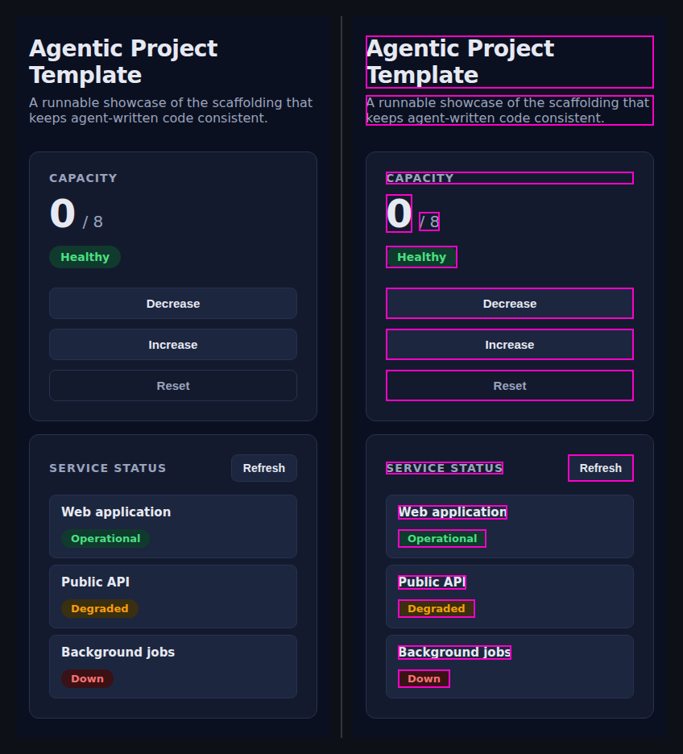

🔍 magenta boxes mark each change — changed: `h1.app__title`, `p.app__tagline`, `button.threshold-counter__button`

- **30** elements added
- interaction states changed: `:hover`, `:focus`

Show all 412 property changes

**Added** `div`

Style:

| Property | Value |
| --- | --- |
| `border-color` | `#e6e9f2` |
| `color` | `#e6e9f2` |
| `font-family` | `ui-sans-serif, system-ui, -apple-system, "Segoe UI", Roboto, sans-serif` |
| `-webkit-locale` | `"en"` |
| `box-sizing` | `border-box` |
| `row-rule-color` | `#e6e9f2` |

**Added** `main.app`

Style:

| Property | Value |
| --- | --- |
| `padding` | `24px 16px` |
| `border-color` | `#e6e9f2` |
| `color` | `#e6e9f2` |
| `font-family` | `ui-sans-serif, system-ui, -apple-system, "Segoe UI", Roboto, sans-serif` |
| `-webkit-locale` | `"en"` |
| `box-sizing` | `border-box` |
| `max-inline-size` | `640px` |
| `row-rule-color` | `#e6e9f2` |

**Added** `header`

Style:

| Property | Value |
| --- | --- |
| `border-color` | `#e6e9f2` |
| `color` | `#e6e9f2` |
| `font-family` | `ui-sans-serif, system-ui, -apple-system, "Segoe UI", Roboto, sans-serif` |
| `-webkit-locale` | `"en"` |
| `box-sizing` | `border-box` |
| `margin-bottom` | `32px` |
| `row-rule-color` | `#e6e9f2` |

**Added** `h1`

Style:

| Property | Value |
| --- | --- |
| `border-color` | `#e6e9f2` |
| `color` | `#e6e9f2` |
| `font-family` | `ui-sans-serif, system-ui, -apple-system, "Segoe UI", Roboto, sans-serif` |
| `font-size` | `28px` |
| `letter-spacing` | `-0.56px` |
| `-webkit-locale` | `"en"` |
| `box-sizing` | `border-box` |
| `margin-bottom` | `8px` |
| `margin-top` | `0px` |
| `row-rule-color` | `#e6e9f2` |

**Added** `p`

Style:

| Property | Value |
| --- | --- |
| `border-color` | `#9aa3bd` |
| `color` | `#9aa3bd` |
| `font-family` | `ui-sans-serif, system-ui, -apple-system, "Segoe UI", Roboto, sans-serif` |
| `-webkit-locale` | `"en"` |
| `box-sizing` | `border-box` |
| `margin-bottom` | `0px` |
| `margin-top` | `0px` |
| `row-rule-color` | `#9aa3bd` |

**Added** `section.threshold-counter`

Style:

| Property | Value |
| --- | --- |
| `padding` | `24px` |
| `border-width` | `1px` |
| `border-style` | `solid` |
| `border-color` | `#273150` |
| `border-radius` | `12px` |
| `background-color` | `#141a2e` |
| `color` | `#e6e9f2` |
| `font-family` | `ui-sans-serif, system-ui, -apple-system, "Segoe UI", Roboto, sans-serif` |
| `-webkit-locale` | `"en"` |
| `box-sizing` | `border-box` |
| `row-rule-color` | `#e6e9f2` |

**Added** `div`

Style:

| Property | Value |
| --- | --- |
| `display` | `flex` |
| `flex-direction` | `column` |
| `gap` | `12px` |
| `border-color` | `#e6e9f2` |
| `color` | `#e6e9f2` |
| `font-family` | `ui-sans-serif, system-ui, -apple-system, "Segoe UI", Roboto, sans-serif` |
| `-webkit-locale` | `"en"` |
| `box-sizing` | `border-box` |
| `flex-wrap` | `wrap` |
| `row-rule-color` | `#e6e9f2` |

**Added** `button` ×2

Style:

| Property | Value |
| --- | --- |
| `display` | `block` |
| `padding` | `10px 16px` |
| `border-width` | `1px` |
| `border-style` | `solid` |
| `border-color` | `#273150` |
| `border-radius` | `8px` |
| `background-color` | `#1d263f` |
| `color` | `#e6e9f2` |
| `font-size` | `15px` |
| `font-weight` | `600` |
| `-webkit-locale` | `"en"` |
| `cursor` | `pointer` |
| `flex-grow` | `1` |
| `min-block-size` | `auto` |
| `min-inline-size` | `96px` |
| `row-rule-color` | `#e6e9f2` |
| `transition-behavior` | `normal, normal` |
| `transition-delay` | `0s, 0s` |
| `transition-duration` | `0.12s, 0.12s` |
| `transition-property` | `background, border-color` |
| `transition-timing-function` | `ease, ease` |

Interactive states:

| State | Property | Value |
| --- | --- | --- |
| `:hover` | `border-color` | `#3a4a72` |
| `:hover` | `background-color` | `#26314f` |
| `:focus` | `outline` | `2px solid rgb(74, 222, 128)` |
| `:focus` | `outline-offset` | `2px` |

**Added** `button`

Style:

| Property | Value |
| --- | --- |
| `display` | `block` |
| `padding` | `10px 16px` |
| `border-width` | `1px` |
| `border-style` | `solid` |
| `border-color` | `#273150` |
| `border-radius` | `8px` |
| `background-color` | `transparent` |
| `color` | `#9aa3bd` |
| `font-size` | `15px` |
| `font-weight` | `600` |
| `-webkit-locale` | `"en"` |
| `cursor` | `pointer` |
| `flex-grow` | `1` |
| `min-block-size` | `auto` |
| `min-inline-size` | `96px` |
| `row-rule-color` | `#9aa3bd` |
| `transition-behavior` | `normal, normal` |
| `transition-delay` | `0s, 0s` |
| `transition-duration` | `0.12s, 0.12s` |
| `transition-property` | `background, border-color` |
| `transition-timing-function` | `ease, ease` |

Interactive states:

| State | Property | Value |
| --- | --- | --- |
| `:hover` | `border-color` | `#3a4a72` |
| `:hover` | `background-color` | `#26314f` |
| `:focus` | `outline` | `2px solid rgb(74, 222, 128)` |
| `:focus` | `outline-offset` | `2px` |

**Added** `h2`

Style:

| Property | Value |
| --- | --- |
| `border-color` | `#9aa3bd` |
| `color` | `#9aa3bd` |
| `font-family` | `ui-sans-serif, system-ui, -apple-system, "Segoe UI", Roboto, sans-serif` |
| `font-size` | `14px` |
| `letter-spacing` | `1.12px` |
| `text-transform` | `uppercase` |
| `-webkit-locale` | `"en"` |
| `box-sizing` | `border-box` |
| `margin-bottom` | `12px` |
| `margin-top` | `0px` |
| `row-rule-color` | `#9aa3bd` |

**Added** `output`

Style:

| Property | Value |
| --- | --- |
| `display` | `inline-block` |
| `padding` | `6px 14px` |
| `border-color` | `#4ade80` |
| `border-radius` | `999px` |
| `background-color` | `#103a2e` |
| `color` | `#4ade80` |
| `font-family` | `ui-sans-serif, system-ui, -apple-system, "Segoe UI", Roboto, sans-serif` |
| `font-size` | `14px` |
| `font-weight` | `600` |
| `-webkit-locale` | `"en"` |
| `box-sizing` | `border-box` |
| `margin-bottom` | `24px` |
| `row-rule-color` | `#4ade80` |

**Added** `p`

Style:

| Property | Value |
| --- | --- |
| `display` | `flex` |
| `align-items` | `baseline` |
| `gap` | `8px` |
| `border-color` | `#e6e9f2` |
| `color` | `#e6e9f2` |
| `font-family` | `ui-sans-serif, system-ui, -apple-system, "Segoe UI", Roboto, sans-serif` |
| `-webkit-locale` | `"en"` |
| `box-sizing` | `border-box` |
| `margin-top` | `0px` |
| `row-rule-color` | `#e6e9f2` |

**Added** `span`

Style:

| Property | Value |
| --- | --- |
| `display` | `block` |
| `border-color` | `#e6e9f2` |
| `color` | `#e6e9f2` |
| `font-family` | `ui-sans-serif, system-ui, -apple-system, "Segoe UI", Roboto, sans-serif` |
| `font-size` | `48px` |
| `font-weight` | `700` |
| `line-height` | `48px` |
| `-webkit-locale` | `"en"` |
| `box-sizing` | `border-box` |
| `min-block-size` | `auto` |
| `min-inline-size` | `auto` |
| `row-rule-color` | `#e6e9f2` |

**Added** `span`

Style:

| Property | Value |
| --- | --- |
| `display` | `block` |
| `border-color` | `#9aa3bd` |
| `color` | `#9aa3bd` |
| `font-family` | `ui-sans-serif, system-ui, -apple-system, "Segoe UI", Roboto, sans-serif` |
| `font-size` | `20px` |
| `-webkit-locale` | `"en"` |
| `box-sizing` | `border-box` |
| `min-block-size` | `auto` |
| `min-inline-size` | `auto` |
| `row-rule-color` | `#9aa3bd` |

**Added** `section.service-status`

Style:

| Property | Value |
| --- | --- |
| `padding` | `24px` |
| `border-width` | `1px` |
| `border-style` | `solid` |
| `border-color` | `#273150` |
| `border-radius` | `12px` |
| `background-color` | `#141a2e` |
| `color` | `#e6e9f2` |
| `font-family` | `ui-sans-serif, system-ui, -apple-system, "Segoe UI", Roboto, sans-serif` |
| `-webkit-locale` | `"en"` |
| `box-sizing` | `border-box` |
| `margin-top` | `16px` |
| `row-rule-color` | `#e6e9f2` |

**Added** `div`

Style:

| Property | Value |
| --- | --- |
| `display` | `flex` |
| `justify-content` | `space-between` |
| `align-items` | `center` |
| `gap` | `12px` |
| `border-color` | `#e6e9f2` |
| `color` | `#e6e9f2` |
| `font-family` | `ui-sans-serif, system-ui, -apple-system, "Segoe UI", Roboto, sans-serif` |
| `-webkit-locale` | `"en"` |
| `box-sizing` | `border-box` |
| `margin-bottom` | `16px` |
| `row-rule-color` | `#e6e9f2` |

**Added** `button`

Style:

| Property | Value |
| --- | --- |
| `display` | `block` |
| `padding` | `8px 14px` |
| `border-width` | `1px` |
| `border-style` | `solid` |
| `border-color` | `#273150` |
| `border-radius` | `8px` |
| `background-color` | `#1d263f` |
| `color` | `#e6e9f2` |
| `font-size` | `14px` |
| `font-weight` | `600` |
| `-webkit-locale` | `"en"` |
| `cursor` | `pointer` |
| `min-block-size` | `auto` |
| `min-inline-size` | `auto` |
| `row-rule-color` | `#e6e9f2` |
| `transition-behavior` | `normal, normal` |
| `transition-delay` | `0s, 0s` |
| `transition-duration` | `0.12s, 0.12s` |
| `transition-property` | `background, border-color` |
| `transition-timing-function` | `ease, ease` |

Interactive states:

| State | Property | Value |
| --- | --- | --- |
| `:hover` | `border-color` | `#3a4a72` |
| `:hover` | `background-color` | `#26314f` |
| `:focus` | `outline` | `2px solid rgb(74, 222, 128)` |
| `:focus` | `outline-offset` | `2px` |

**Added** `h2`

Style:

| Property | Value |
| --- | --- |
| `border-color` | `#9aa3bd` |
| `color` | `#9aa3bd` |
| `font-family` | `ui-sans-serif, system-ui, -apple-system, "Segoe UI", Roboto, sans-serif` |
| `font-size` | `14px` |
| `letter-spacing` | `1.12px` |
| `text-transform` | `uppercase` |
| `-webkit-locale` | `"en"` |
| `box-sizing` | `border-box` |
| `margin-bottom` | `0px` |
| `margin-top` | `0px` |
| `min-block-size` | `auto` |
| `min-inline-size` | `auto` |
| `row-rule-color` | `#9aa3bd` |

**Added** `output`

Style:

| Property | Value |
| --- | --- |
| `display` | `block` |
| `border-color` | `#e6e9f2` |
| `color` | `#e6e9f2` |
| `font-family` | `ui-sans-serif, system-ui, -apple-system, "Segoe UI", Roboto, sans-serif` |
| `-webkit-locale` | `"en"` |
| `box-sizing` | `border-box` |
| `row-rule-color` | `#e6e9f2` |

**Added** `ul`

Style:

| Property | Value |
| --- | --- |
| `display` | `flex` |
| `flex-direction` | `column` |
| `gap` | `8px` |
| `border-color` | `#e6e9f2` |
| `color` | `#e6e9f2` |
| `font-family` | `ui-sans-serif, system-ui, -apple-system, "Segoe UI", Roboto, sans-serif` |
| `-webkit-locale` | `"en"` |
| `box-sizing` | `border-box` |
| `list-style-type` | `none` |
| `margin-bottom` | `0px` |
| `margin-top` | `0px` |
| `padding-left` | `0px` |
| `row-rule-color` | `#e6e9f2` |

**Added** `li` ×3

Style:

| Property | Value |
| --- | --- |
| `display` | `flex` |
| `flex-direction` | `column` |
| `justify-content` | `space-between` |
| `align-items` | `flex-start` |
| `gap` | `12px` |
| `padding` | `12px 14px` |
| `border-width` | `1px` |
| `border-style` | `solid` |
| `border-color` | `#273150` |
| `border-radius` | `8px` |
| `background-color` | `#1d263f` |
| `color` | `#e6e9f2` |
| `font-family` | `ui-sans-serif, system-ui, -apple-system, "Segoe UI", Roboto, sans-serif` |
| `-webkit-locale` | `"en"` |
| `box-sizing` | `border-box` |
| `list-style-position` | `outside` |
| `list-style-type` | `none` |
| `min-block-size` | `auto` |
| `min-inline-size` | `auto` |
| `row-rule-color` | `#e6e9f2` |

**Added** `span` ×3

Style:

| Property | Value |
| --- | --- |
| `display` | `block` |
| `border-color` | `#e6e9f2` |
| `color` | `#e6e9f2` |
| `font-family` | `ui-sans-serif, system-ui, -apple-system, "Segoe UI", Roboto, sans-serif` |
| `font-size` | `15px` |
| `font-weight` | `600` |
| `-webkit-locale` | `"en"` |
| `box-sizing` | `border-box` |
| `list-style-type` | `none` |
| `min-block-size` | `auto` |
| `min-inline-size` | `auto` |
| `row-rule-color` | `#e6e9f2` |

**Added** `span`

Style:

| Property | Value |
| --- | --- |
| `display` | `block` |
| `padding` | `4px 12px` |
| `border-color` | `#4ade80` |
| `border-radius` | `999px` |
| `background-color` | `#103a2e` |
| `color` | `#4ade80` |
| `font-family` | `ui-sans-serif, system-ui, -apple-system, "Segoe UI", Roboto, sans-serif` |
| `font-size` | `13px` |
| `font-weight` | `600` |
| `-webkit-locale` | `"en"` |
| `box-sizing` | `border-box` |
| `list-style-type` | `none` |
| `min-block-size` | `auto` |
| `min-inline-size` | `auto` |
| `row-rule-color` | `#4ade80` |

**Added** `span`

Style:

| Property | Value |
| --- | --- |
| `display` | `block` |
| `padding` | `4px 12px` |
| `border-color` | `#f59e0b` |
| `border-radius` | `999px` |
| `background-color` | `#3a2f10` |
| `color` | `#f59e0b` |
| `font-family` | `ui-sans-serif, system-ui, -apple-system, "Segoe UI", Roboto, sans-serif` |
| `font-size` | `13px` |
| `font-weight` | `600` |
| `-webkit-locale` | `"en"` |
| `box-sizing` | `border-box` |
| `list-style-type` | `none` |
| `min-block-size` | `auto` |
| `min-inline-size` | `auto` |
| `row-rule-color` | `#f59e0b` |

**Added** `span`

Style:

| Property | Value |
| --- | --- |
| `display` | `block` |
| `padding` | `4px 12px` |
| `border-color` | `#f87171` |
| `border-radius` | `999px` |
| `background-color` | `#3a1115` |
| `color` | `#f87171` |
| `font-family` | `ui-sans-serif, system-ui, -apple-system, "Segoe UI", Roboto, sans-serif` |
| `font-size` | `13px` |
| `font-weight` | `600` |
| `-webkit-locale` | `"en"` |
| `box-sizing` | `border-box` |
| `list-style-type` | `none` |
| `min-block-size` | `auto` |
| `min-inline-size` | `auto` |
| `row-rule-color` | `#f87171` |

### `div` · 30 elements removed

_Identical across 2 surfaces: service-status-success @ 768 · threshold-counter @ 768_

◀ before  ·  after ▶ — service-status-success @ 768

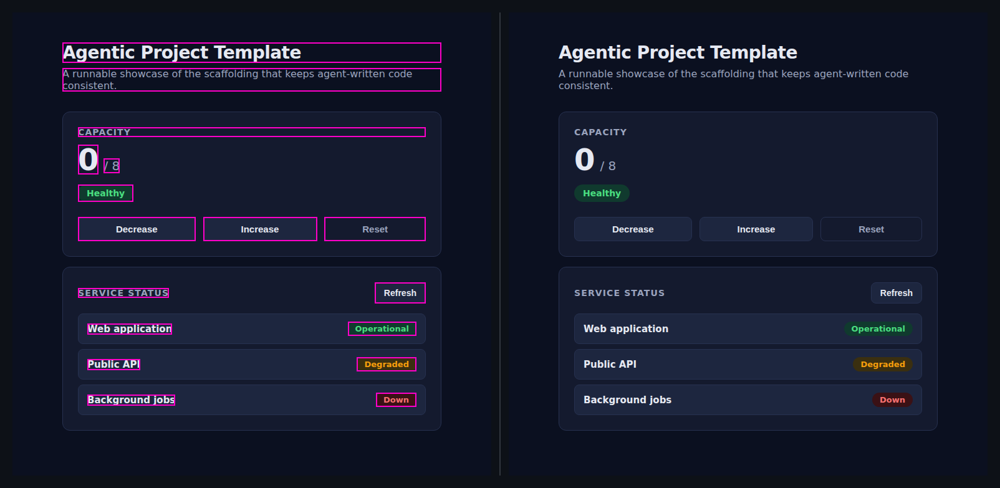

🔍 magenta boxes mark each change — changed: `h1.app__title`, `p.app__tagline`, `button.threshold-counter__button`

- **30** elements removed
- interaction states changed: `:hover`, `:focus`

Show all 16 property changes

**Removed** `div` ×3

**Removed** `main.app`

**Removed** `header`

**Removed** `h1`

**Removed** `p` ×2

**Removed** `section.threshold-counter`

**Removed** `button` ×4

**Removed** `h2` ×2

**Removed** `output` ×2

**Removed** `span` ×8

**Removed** `section.service-status`

**Removed** `ul`

**Removed** `li` ×3

### `div` · 30 elements added

_Identical across 2 surfaces: service-status-success @ 768 · threshold-counter @ 768_

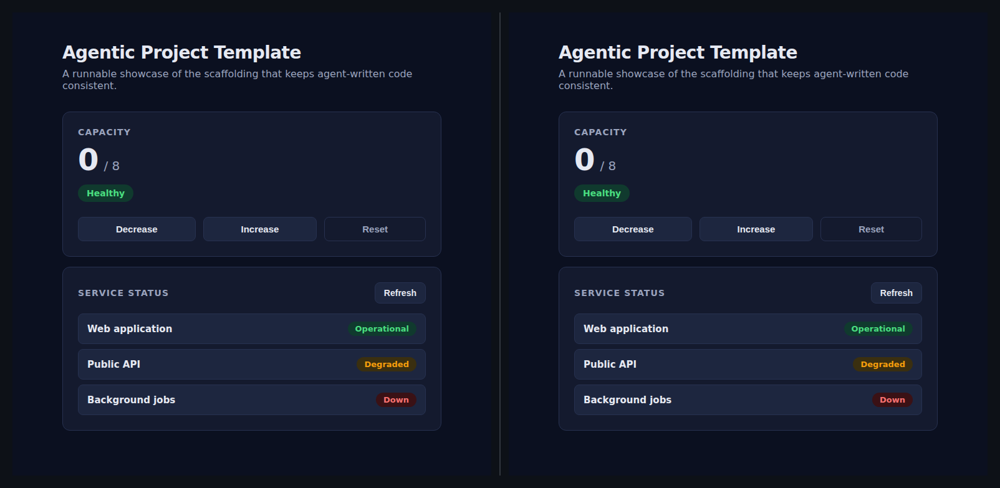

◀ before  ·  after ▶ — service-status-success @ 768

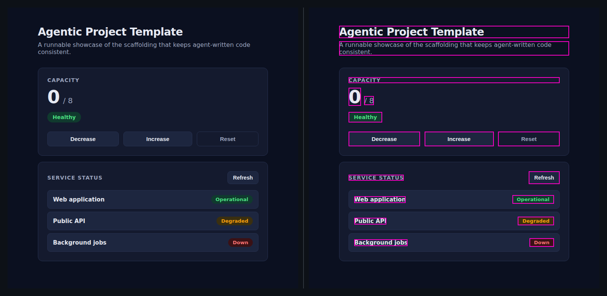

🔍 magenta boxes mark each change — changed: `h1.app__title`, `p.app__tagline`, `button.threshold-counter__button`

- **30** elements added
- interaction states changed: `:hover`, `:focus`

Show all 410 property changes

**Added** `div`

Style:

| Property | Value |
| --- | --- |
| `border-color` | `#e6e9f2` |
| `color` | `#e6e9f2` |
| `font-family` | `ui-sans-serif, system-ui, -apple-system, "Segoe UI", Roboto, sans-serif` |
| `-webkit-locale` | `"en"` |
| `box-sizing` | `border-box` |
| `row-rule-color` | `#e6e9f2` |

**Added** `main.app`

Style:

| Property | Value |
| --- | --- |
| `padding` | `48px 16px` |
| `border-color` | `#e6e9f2` |
| `color` | `#e6e9f2` |
| `font-family` | `ui-sans-serif, system-ui, -apple-system, "Segoe UI", Roboto, sans-serif` |
| `-webkit-locale` | `"en"` |
| `box-sizing` | `border-box` |
| `margin-left` | `64px` |
| `margin-right` | `64px` |
| `max-inline-size` | `640px` |
| `row-rule-color` | `#e6e9f2` |

**Added** `header`

Style:

| Property | Value |
| --- | --- |
| `border-color` | `#e6e9f2` |
| `color` | `#e6e9f2` |
| `font-family` | `ui-sans-serif, system-ui, -apple-system, "Segoe UI", Roboto, sans-serif` |
| `-webkit-locale` | `"en"` |
| `box-sizing` | `border-box` |
| `margin-bottom` | `32px` |
| `row-rule-color` | `#e6e9f2` |

**Added** `h1`

Style:

| Property | Value |
| --- | --- |
| `border-color` | `#e6e9f2` |
| `color` | `#e6e9f2` |
| `font-family` | `ui-sans-serif, system-ui, -apple-system, "Segoe UI", Roboto, sans-serif` |
| `font-size` | `28px` |
| `letter-spacing` | `-0.56px` |
| `-webkit-locale` | `"en"` |
| `box-sizing` | `border-box` |
| `margin-bottom` | `8px` |
| `margin-top` | `0px` |
| `row-rule-color` | `#e6e9f2` |

**Added** `p`

Style:

| Property | Value |
| --- | --- |
| `border-color` | `#9aa3bd` |
| `color` | `#9aa3bd` |
| `font-family` | `ui-sans-serif, system-ui, -apple-system, "Segoe UI", Roboto, sans-serif` |
| `-webkit-locale` | `"en"` |
| `box-sizing` | `border-box` |
| `margin-bottom` | `0px` |
| `margin-top` | `0px` |
| `row-rule-color` | `#9aa3bd` |

**Added** `section.threshold-counter`

Style:

| Property | Value |
| --- | --- |
| `padding` | `24px` |
| `border-width` | `1px` |
| `border-style` | `solid` |
| `border-color` | `#273150` |
| `border-radius` | `12px` |
| `background-color` | `#141a2e` |
| `color` | `#e6e9f2` |
| `font-family` | `ui-sans-serif, system-ui, -apple-system, "Segoe UI", Roboto, sans-serif` |
| `-webkit-locale` | `"en"` |
| `box-sizing` | `border-box` |
| `row-rule-color` | `#e6e9f2` |

**Added** `div`

Style:

| Property | Value |
| --- | --- |
| `display` | `flex` |
| `gap` | `12px` |
| `border-color` | `#e6e9f2` |
| `color` | `#e6e9f2` |
| `font-family` | `ui-sans-serif, system-ui, -apple-system, "Segoe UI", Roboto, sans-serif` |
| `-webkit-locale` | `"en"` |
| `box-sizing` | `border-box` |
| `flex-wrap` | `wrap` |
| `row-rule-color` | `#e6e9f2` |

**Added** `button` ×2

Style:

| Property | Value |
| --- | --- |
| `display` | `block` |
| `padding` | `10px 16px` |
| `border-width` | `1px` |
| `border-style` | `solid` |
| `border-color` | `#273150` |
| `border-radius` | `8px` |
| `background-color` | `#1d263f` |
| `color` | `#e6e9f2` |
| `font-size` | `15px` |
| `font-weight` | `600` |
| `-webkit-locale` | `"en"` |
| `cursor` | `pointer` |
| `flex-grow` | `1` |
| `min-block-size` | `auto` |
| `min-inline-size` | `96px` |
| `row-rule-color` | `#e6e9f2` |
| `transition-behavior` | `normal, normal` |
| `transition-delay` | `0s, 0s` |
| `transition-duration` | `0.12s, 0.12s` |
| `transition-property` | `background, border-color` |
| `transition-timing-function` | `ease, ease` |

Interactive states:

| State | Property | Value |
| --- | --- | --- |
| `:hover` | `border-color` | `#3a4a72` |
| `:hover` | `background-color` | `#26314f` |
| `:focus` | `outline` | `2px solid rgb(74, 222, 128)` |
| `:focus` | `outline-offset` | `2px` |

**Added** `button`

Style:

| Property | Value |
| --- | --- |
| `display` | `block` |
| `padding` | `10px 16px` |
| `border-width` | `1px` |
| `border-style` | `solid` |
| `border-color` | `#273150` |
| `border-radius` | `8px` |
| `background-color` | `transparent` |
| `color` | `#9aa3bd` |
| `font-size` | `15px` |
| `font-weight` | `600` |
| `-webkit-locale` | `"en"` |
| `cursor` | `pointer` |
| `flex-grow` | `1` |
| `min-block-size` | `auto` |
| `min-inline-size` | `96px` |
| `row-rule-color` | `#9aa3bd` |
| `transition-behavior` | `normal, normal` |
| `transition-delay` | `0s, 0s` |
| `transition-duration` | `0.12s, 0.12s` |
| `transition-property` | `background, border-color` |
| `transition-timing-function` | `ease, ease` |

Interactive states:

| State | Property | Value |
| --- | --- | --- |
| `:hover` | `border-color` | `#3a4a72` |
| `:hover` | `background-color` | `#26314f` |
| `:focus` | `outline` | `2px solid rgb(74, 222, 128)` |
| `:focus` | `outline-offset` | `2px` |

**Added** `h2`

Style:

| Property | Value |
| --- | --- |
| `border-color` | `#9aa3bd` |
| `color` | `#9aa3bd` |
| `font-family` | `ui-sans-serif, system-ui, -apple-system, "Segoe UI", Roboto, sans-serif` |
| `font-size` | `14px` |
| `letter-spacing` | `1.12px` |
| `text-transform` | `uppercase` |
| `-webkit-locale` | `"en"` |
| `box-sizing` | `border-box` |
| `margin-bottom` | `12px` |
| `margin-top` | `0px` |
| `row-rule-color` | `#9aa3bd` |

**Added** `output`

Style:

| Property | Value |
| --- | --- |
| `display` | `inline-block` |
| `padding` | `6px 14px` |
| `border-color` | `#4ade80` |
| `border-radius` | `999px` |
| `background-color` | `#103a2e` |
| `color` | `#4ade80` |
| `font-family` | `ui-sans-serif, system-ui, -apple-system, "Segoe UI", Roboto, sans-serif` |
| `font-size` | `14px` |
| `font-weight` | `600` |
| `-webkit-locale` | `"en"` |
| `box-sizing` | `border-box` |
| `margin-bottom` | `24px` |
| `row-rule-color` | `#4ade80` |

**Added** `p`

Style:

| Property | Value |
| --- | --- |
| `display` | `flex` |
| `align-items` | `baseline` |
| `gap` | `8px` |
| `border-color` | `#e6e9f2` |
| `color` | `#e6e9f2` |
| `font-family` | `ui-sans-serif, system-ui, -apple-system, "Segoe UI", Roboto, sans-serif` |
| `-webkit-locale` | `"en"` |
| `box-sizing` | `border-box` |
| `margin-top` | `0px` |
| `row-rule-color` | `#e6e9f2` |

**Added** `span`

Style:

| Property | Value |
| --- | --- |
| `display` | `block` |
| `border-color` | `#e6e9f2` |
| `color` | `#e6e9f2` |
| `font-family` | `ui-sans-serif, system-ui, -apple-system, "Segoe UI", Roboto, sans-serif` |
| `font-size` | `48px` |
| `font-weight` | `700` |
| `line-height` | `48px` |
| `-webkit-locale` | `"en"` |
| `box-sizing` | `border-box` |
| `min-block-size` | `auto` |
| `min-inline-size` | `auto` |
| `row-rule-color` | `#e6e9f2` |

**Added** `span`

Style:

| Property | Value |
| --- | --- |
| `display` | `block` |
| `border-color` | `#9aa3bd` |
| `color` | `#9aa3bd` |
| `font-family` | `ui-sans-serif, system-ui, -apple-system, "Segoe UI", Roboto, sans-serif` |
| `font-size` | `20px` |
| `-webkit-locale` | `"en"` |
| `box-sizing` | `border-box` |
| `min-block-size` | `auto` |
| `min-inline-size` | `auto` |
| `row-rule-color` | `#9aa3bd` |

**Added** `section.service-status`

Style:

| Property | Value |
| --- | --- |
| `padding` | `24px` |
| `border-width` | `1px` |
| `border-style` | `solid` |
| `border-color` | `#273150` |
| `border-radius` | `12px` |
| `background-color` | `#141a2e` |
| `color` | `#e6e9f2` |
| `font-family` | `ui-sans-serif, system-ui, -apple-system, "Segoe UI", Roboto, sans-serif` |
| `-webkit-locale` | `"en"` |
| `box-sizing` | `border-box` |
| `margin-top` | `16px` |
| `row-rule-color` | `#e6e9f2` |

**Added** `div`

Style:

| Property | Value |
| --- | --- |
| `display` | `flex` |
| `justify-content` | `space-between` |
| `align-items` | `center` |
| `gap` | `12px` |
| `border-color` | `#e6e9f2` |
| `color` | `#e6e9f2` |
| `font-family` | `ui-sans-serif, system-ui, -apple-system, "Segoe UI", Roboto, sans-serif` |
| `-webkit-locale` | `"en"` |
| `box-sizing` | `border-box` |
| `margin-bottom` | `16px` |
| `row-rule-color` | `#e6e9f2` |

**Added** `button`

Style:

| Property | Value |
| --- | --- |
| `display` | `block` |
| `padding` | `8px 14px` |
| `border-width` | `1px` |
| `border-style` | `solid` |
| `border-color` | `#273150` |
| `border-radius` | `8px` |
| `background-color` | `#1d263f` |
| `color` | `#e6e9f2` |
| `font-size` | `14px` |
| `font-weight` | `600` |
| `-webkit-locale` | `"en"` |
| `cursor` | `pointer` |
| `min-block-size` | `auto` |
| `min-inline-size` | `auto` |
| `row-rule-color` | `#e6e9f2` |
| `transition-behavior` | `normal, normal` |
| `transition-delay` | `0s, 0s` |
| `transition-duration` | `0.12s, 0.12s` |
| `transition-property` | `background, border-color` |
| `transition-timing-function` | `ease, ease` |

Interactive states:

| State | Property | Value |
| --- | --- | --- |
| `:hover` | `border-color` | `#3a4a72` |
| `:hover` | `background-color` | `#26314f` |
| `:focus` | `outline` | `2px solid rgb(74, 222, 128)` |
| `:focus` | `outline-offset` | `2px` |

**Added** `h2`

Style:

| Property | Value |
| --- | --- |
| `border-color` | `#9aa3bd` |
| `color` | `#9aa3bd` |
| `font-family` | `ui-sans-serif, system-ui, -apple-system, "Segoe UI", Roboto, sans-serif` |
| `font-size` | `14px` |
| `letter-spacing` | `1.12px` |
| `text-transform` | `uppercase` |
| `-webkit-locale` | `"en"` |
| `box-sizing` | `border-box` |
| `margin-bottom` | `0px` |
| `margin-top` | `0px` |
| `min-block-size` | `auto` |
| `min-inline-size` | `auto` |
| `row-rule-color` | `#9aa3bd` |

**Added** `output`

Style:

| Property | Value |
| --- | --- |
| `display` | `block` |
| `border-color` | `#e6e9f2` |
| `color` | `#e6e9f2` |
| `font-family` | `ui-sans-serif, system-ui, -apple-system, "Segoe UI", Roboto, sans-serif` |
| `-webkit-locale` | `"en"` |
| `box-sizing` | `border-box` |
| `row-rule-color` | `#e6e9f2` |

**Added** `ul`

Style:

| Property | Value |
| --- | --- |
| `display` | `flex` |
| `flex-direction` | `column` |
| `gap` | `8px` |
| `border-color` | `#e6e9f2` |
| `color` | `#e6e9f2` |
| `font-family` | `ui-sans-serif, system-ui, -apple-system, "Segoe UI", Roboto, sans-serif` |
| `-webkit-locale` | `"en"` |
| `box-sizing` | `border-box` |
| `list-style-type` | `none` |
| `margin-bottom` | `0px` |
| `margin-top` | `0px` |
| `padding-left` | `0px` |
| `row-rule-color` | `#e6e9f2` |

**Added** `li` ×3

Style:

| Property | Value |
| --- | --- |
| `display` | `flex` |
| `justify-content` | `space-between` |
| `align-items` | `center` |
| `gap` | `12px` |
| `padding` | `12px 14px` |
| `border-width` | `1px` |
| `border-style` | `solid` |
| `border-color` | `#273150` |
| `border-radius` | `8px` |
| `background-color` | `#1d263f` |
| `color` | `#e6e9f2` |
| `font-family` | `ui-sans-serif, system-ui, -apple-system, "Segoe UI", Roboto, sans-serif` |
| `-webkit-locale` | `"en"` |
| `box-sizing` | `border-box` |
| `list-style-position` | `outside` |
| `list-style-type` | `none` |
| `min-block-size` | `auto` |
| `min-inline-size` | `auto` |
| `row-rule-color` | `#e6e9f2` |

**Added** `span` ×3

Style:

| Property | Value |
| --- | --- |
| `display` | `block` |
| `border-color` | `#e6e9f2` |
| `color` | `#e6e9f2` |
| `font-family` | `ui-sans-serif, system-ui, -apple-system, "Segoe UI", Roboto, sans-serif` |
| `font-size` | `15px` |
| `font-weight` | `600` |
| `-webkit-locale` | `"en"` |
| `box-sizing` | `border-box` |
| `list-style-type` | `none` |
| `min-block-size` | `auto` |
| `min-inline-size` | `auto` |
| `row-rule-color` | `#e6e9f2` |

**Added** `span`

Style:

| Property | Value |
| --- | --- |
| `display` | `block` |
| `padding` | `4px 12px` |
| `border-color` | `#4ade80` |
| `border-radius` | `999px` |
| `background-color` | `#103a2e` |
| `color` | `#4ade80` |
| `font-family` | `ui-sans-serif, system-ui, -apple-system, "Segoe UI", Roboto, sans-serif` |
| `font-size` | `13px` |
| `font-weight` | `600` |
| `-webkit-locale` | `"en"` |
| `box-sizing` | `border-box` |
| `list-style-type` | `none` |
| `min-block-size` | `auto` |
| `min-inline-size` | `auto` |
| `row-rule-color` | `#4ade80` |

**Added** `span`

Style:

| Property | Value |
| --- | --- |
| `display` | `block` |
| `padding` | `4px 12px` |
| `border-color` | `#f59e0b` |
| `border-radius` | `999px` |
| `background-color` | `#3a2f10` |
| `color` | `#f59e0b` |
| `font-family` | `ui-sans-serif, system-ui, -apple-system, "Segoe UI", Roboto, sans-serif` |
| `font-size` | `13px` |
| `font-weight` | `600` |
| `-webkit-locale` | `"en"` |
| `box-sizing` | `border-box` |
| `list-style-type` | `none` |
| `min-block-size` | `auto` |
| `min-inline-size` | `auto` |
| `row-rule-color` | `#f59e0b` |

**Added** `span`

Style:

| Property | Value |
| --- | --- |
| `display` | `block` |
| `padding` | `4px 12px` |
| `border-color` | `#f87171` |
| `border-radius` | `999px` |
| `background-color` | `#3a1115` |
| `color` | `#f87171` |
| `font-family` | `ui-sans-serif, system-ui, -apple-system, "Segoe UI", Roboto, sans-serif` |
| `font-size` | `13px` |
| `font-weight` | `600` |
| `-webkit-locale` | `"en"` |
| `box-sizing` | `border-box` |
| `list-style-type` | `none` |
| `min-block-size` | `auto` |
| `min-inline-size` | `auto` |
| `row-rule-color` | `#f87171` |

